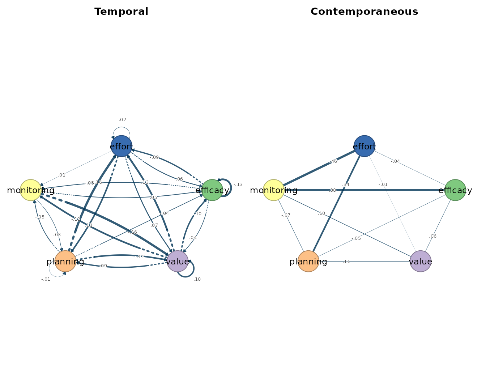
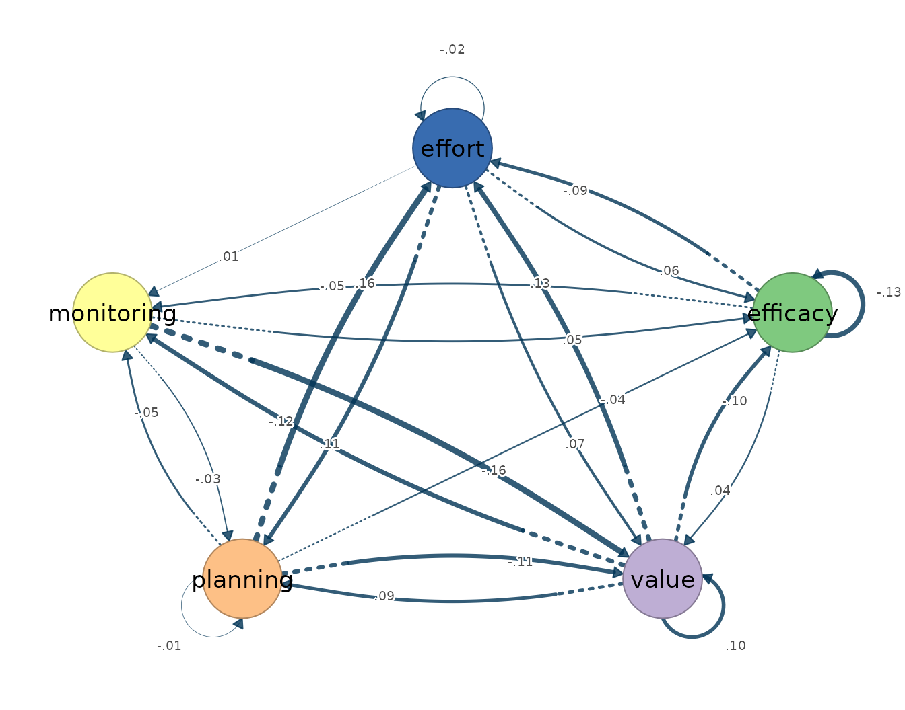
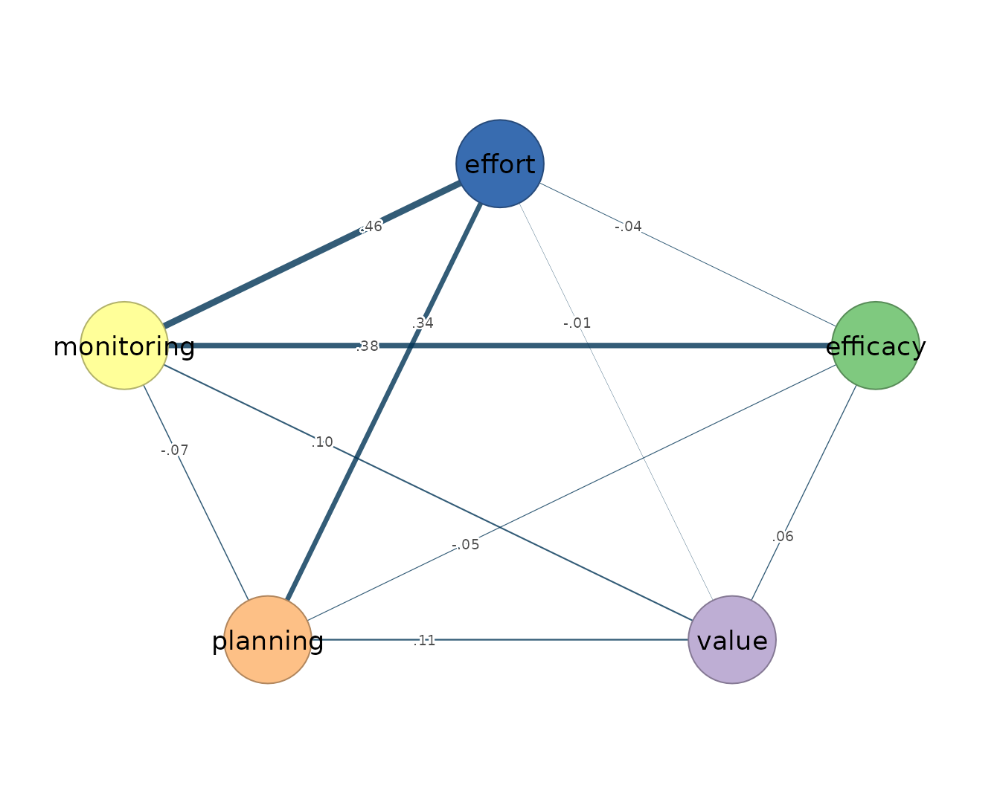
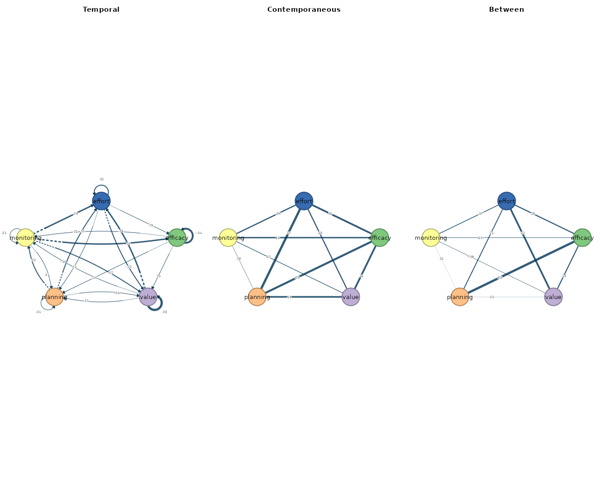
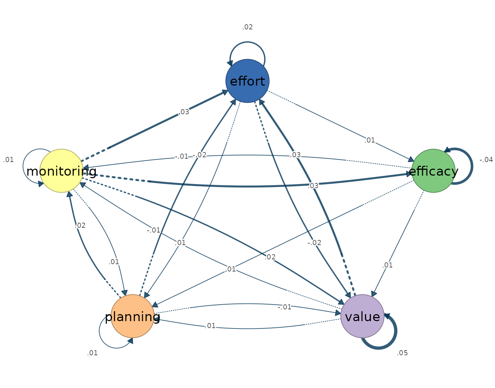
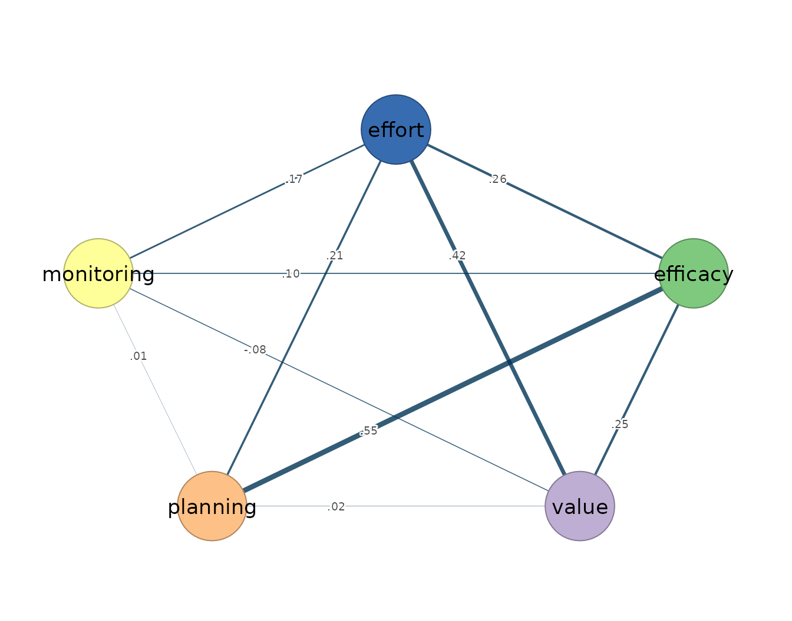

# 6. Bayesian VAR and DSEM

[`fit_var_bayes()`](https://mohsaqr.github.io/idiographic/reference/fit_var_bayes.md)
estimates a single-person Bayesian vector autoregression of order one:
an idiographic model, fitted to one individual’s multivariate series, in
which each occasion’s measurements are predicted jointly by the values
of all variables one occasion earlier and by the associations that
remain among the variables within the same occasion. The estimands are
the same two within-person networks the ordinary VAR of
[`fit_var()`](https://mohsaqr.github.io/idiographic/reference/fit_var.md)
returns. The temporal network is directed: an edge `from -> to` states
that the value of `from` at occasion $`t-1`$ predicts the value of `to`
at occasion $`t`$, holding the other lagged variables constant. The
contemporaneous network is undirected: its edges are the partial
correlations among the innovations, the within-occasion associations
that lagged prediction does not account for. The Bayesian estimator
places priors on the lagged coefficients and the innovation covariance
and reports posterior distributions over these same quantities, so each
edge carries a credible interval rather than a point estimate alone. The
model presumes weak stationarity — constant mean, variance, and
autocovariance across the observation window — linear lag-one dynamics,
approximately Gaussian fluctuations, and equally spaced measurement
occasions.

[`fit_mlvar_bayes()`](https://mohsaqr.github.io/idiographic/reference/fit_mlvar_bayes.md)
and
[`fit_mlvar_mplus()`](https://mohsaqr.github.io/idiographic/reference/fit_mlvar_mplus.md)
estimate the multilevel analogue, the Bayesian multilevel VAR in its
dynamic structural equation modelling (DSEM) formulation. Where the
single-person model describes one individual, the multilevel model pools
a panel of individuals and separates the variance into layers: a
population-level average within-person temporal network, a
population-level average within-person contemporaneous network, and a
between-person network — a partial-correlation network over the subject
means, describing how people who are high on one variable on average
tend to differ on the others. The between layer is a structure of stable
individual differences, not a within-person process, and the two need
not coincide; treating between-person associations as if they described
anyone’s dynamics is the ergodicity error the idiographic literature
warns against.
[`fit_mlvar_mplus()`](https://mohsaqr.github.io/idiographic/reference/fit_mlvar_mplus.md)
targets the Mplus DSEM backend for laboratories with a licensed Mplus
installation that require its syntax and diagnostics;
[`fit_mlvar_bayes()`](https://mohsaqr.github.io/idiographic/reference/fit_mlvar_bayes.md)
estimates a native model whose explicitly documented slices are
validated against frozen Mplus outputs without requiring the external
dependency.

Bayesian estimation is appropriate when posterior intervals, prior
regularization, or DSEM-style modelling is central to the analysis; when
the goal is a fast point-estimate comparison,
[`fit_var()`](https://mohsaqr.github.io/idiographic/reference/fit_var.md)
and
[`fit_mlvar()`](https://mohsaqr.github.io/idiographic/reference/fit_mlvar.md)
provide that baseline. The native Bayesian chunks below are evaluated
during the build, so every printed result comes from the displayed call.
Only the external Mplus call remains unevaluated because it requires
licensed software.

## Data and preprocessing

The estimators expect long format: one row per person-occasion, an id
column, and numeric time-varying indicators ordered within person. The
bundled `srl` data hold self-regulated-learning indicators for 36
students measured over 156 occasions each. The single-person calls fit
one student, Grace, on five indicators; the multilevel calls use the
full panel of 36 students on the same variables. Because the estimators
absorb assumption violations silently — a trend, for instance, inflates
the autoregressive diagonal rather than producing an error — the
stationarity screen precedes the fit.

``` r

vars <- c("efficacy", "value", "planning", "monitoring", "effort")
preprocess(srl, vars = vars, id = "name", subject = "Grace")
#> Idiographic Preprocessing
#>   Variables:      5 (efficacy, value, planning, monitoring, effort)
#>   Ordered rows:   156
#>   Retained pairs: 155
#>   Trend flags:    0
#>   High AR flags:  0
#>   Drift flags:    0
#>   Unit-root risk: 0
#>   Zero variance:  0
#>   Tables:         x$pairs | x$counts | x$diagnostics
```

Grace’s 156 ordered occasions yield 155 complete current/lagged pairs,
and no series trips a trend, high-autoregression, drift, unit-root, or
zero-variance flag, so the models are specified on the series as they
stand.

## Fitting the model

The single-person call takes the data, the variable set, the id column,
and the subject; `n_iter` sets the chain length, `n_chains` the number
of chains, and `seed` fixes the random state for reproducibility.

``` r

var_bayes_fit <- fit_var_bayes(
  srl, vars = vars, id = "name", subject = "Grace",
  n_iter = 1000, n_chains = 2, seed = 1
)
var_bayes_fit
#> Bayesian VAR(1) result (unregularized, Mplus-targeted)
#>   Variables:    5 (efficacy, value, planning, monitoring, effort)
#>   Observations: 155
#>   MCMC: 2 chains x 1000 iter, 1000 draws | max PSR = 1.008
#>   Temporal 95% CIs excluding 0: 0 / 25
#> 
#>   Temporal [directed]
#>     weights [-0.157, 0.160]  |  +12 / -13 edges
#>                efficacy value planning monitoring effort
#>     efficacy      -0.13  0.04     0.00      -0.05  -0.09
#>     value         -0.10  0.10     0.09      -0.12   0.13
#>     planning      -0.04 -0.11    -0.01      -0.05   0.16
#>     monitoring     0.05 -0.16    -0.03       0.00   0.00
#>     effort         0.06  0.07     0.11       0.01  -0.02
#> 
#>   Contemporaneous [undirected]
#>     weights [-0.066, 0.465]  |  +6 / -4 edges
#>                efficacy value planning monitoring effort
#>     efficacy       0.00  0.06    -0.05       0.38  -0.04
#>     value          0.06  0.00     0.11       0.10  -0.01
#>     planning      -0.05  0.11     0.00      -0.07   0.34
#>     monitoring     0.38  0.10    -0.07       0.00   0.46
#>     effort        -0.04 -0.01     0.34       0.46   0.00
#> 
#>   coefs(x) | matrices(x) | edges(x) | nodes(x) | summary(x)
```

The evaluated fit uses two chains, retains 1,000 posterior draws after
burn-in, and reports a maximum potential scale reduction statistic close
to 1. No temporal 95% credible interval excludes zero in this run.

The multilevel Bayesian call uses the same panel structure as
[`fit_mlvar()`](https://mohsaqr.github.io/idiographic/reference/fit_mlvar.md).
Setting `temporal = "fixed"` estimates the average lag-one matrix
without subject-specific random deviations; `n_iter`, `n_chains`, and
`seed` control the MCMC as before.

``` r

mlvar_bayes_fit <- fit_mlvar_bayes(
  srl, vars = vars, id = "name", temporal = "fixed",
  n_iter = 1000, n_chains = 2, seed = 1
)
mlvar_bayes_fit
#> Bayesian mlVAR (Mplus DSEM-targeted, temporal = fixed): 36 subjects, 5548 observations, 5 variables
#>   MCMC: 2 chains x 1000 iter (500 burn-in), 1000 draws | max PSR = 1.005
#>   Temporal 95% CIs excluding 0: 3 / 25
#> 
#>   Temporal [directed]
#>     weights [-0.042, 0.051]  |  +18 / -7 edges
#>                efficacy value planning monitoring effort
#>     efficacy      -0.04  0.01     0.01      -0.01   0.00
#>     value          0.00  0.05     0.01      -0.01   0.03
#>     planning       0.00 -0.01     0.01       0.02  -0.02
#>     monitoring     0.03  0.02     0.01       0.01   0.03
#>     effort         0.01 -0.02     0.01       0.00   0.02
#> 
#>   Contemporaneous [undirected]
#>     weights [0.026, 0.274]  |  +10 / -0 edges
#>                efficacy value planning monitoring effort
#>     efficacy       0.00  0.21     0.24       0.16   0.21
#>     value          0.21  0.00     0.19       0.07   0.13
#>     planning       0.24  0.19     0.00       0.03   0.27
#>     monitoring     0.16  0.07     0.03       0.00   0.14
#>     effort         0.21  0.13     0.27       0.14   0.00
#> 
#>   Between [undirected]
#>     weights [-0.075, 0.548]  |  +9 / -1 edges
#>                efficacy value planning monitoring effort
#>     efficacy       0.00  0.25     0.55       0.10   0.26
#>     value          0.25  0.00     0.02      -0.08   0.42
#>     planning       0.55  0.02     0.00       0.01   0.21
#>     monitoring     0.10 -0.08     0.01       0.00   0.17
#>     effort         0.26  0.42     0.21       0.17   0.00
#> 
#>   coefs(x) posterior median/SD/CI | matrices(x) | edges(x) | summary(x)
```

The evaluated multilevel fit also retains 1,000 posterior draws and has
a maximum potential scale reduction statistic close to 1. Three of the
25 temporal 95% credible intervals exclude zero.

The Mplus backend call is shown but not evaluated, because it requires
the suggested `mlVAR` and `MplusAutomation` packages plus a licensed
Mplus installation discoverable by
[`MplusAutomation::detectMplus()`](https://michaelhallquist.github.io/MplusAutomation/reference/detectMplus.html).

``` r

mplus_fit <- fit_mlvar_mplus(
  srl, vars = vars, id = "name",
  temporal = "fixed", contemporaneous = "fixed"
)
```

## Reading the output

The single-person posterior medians reproduce the ordinary VAR pattern.
Monitoring at occasion $`t-1`$ predicts lower value at occasion $`t`$
(posterior median −0.121), planning predicts higher effort (0.107), and
the largest contemporaneous edge is monitoring–effort (0.465). None of
the temporal credible intervals excludes zero, so these medians are
descriptive rather than evidence of selected temporal paths. The same
accessors that serve the point-estimate fits apply:
[`summary()`](https://rdrr.io/r/base/summary.html) reports one row per
network layer,
[`edges()`](https://mohsaqr.github.io/idiographic/reference/edges.md)
lists edges in decreasing magnitude,
[`nodes()`](https://mohsaqr.github.io/idiographic/reference/nodes.md)
gives node-level strength, and
[`matrices()`](https://mohsaqr.github.io/idiographic/reference/matrices.md)
returns the underlying posterior-median matrices.

``` r

summary(var_bayes_fit)
#>           network n_nodes n_edges density mean_abs_weight n_positive n_negative
#> 1        temporal       5      20       1       0.0732450         10         10
#> 2 contemporaneous       5      10       1       0.1614563          6          4
edges(var_bayes_fit, n = 12)
#>     network       from         to      weight
#> 1  temporal   planning     effort  0.15953567
#> 2  temporal monitoring      value -0.15742877
#> 3  temporal      value     effort  0.12944831
#> 4  temporal      value monitoring -0.12057964
#> 5  temporal   planning      value -0.11206296
#> 6  temporal     effort   planning  0.10723652
#> 7  temporal      value   efficacy -0.09825493
#> 8  temporal      value   planning  0.09029697
#> 9  temporal   efficacy     effort -0.08742151
#> 10 temporal     effort      value  0.06741039
#> 11 temporal     effort   efficacy  0.05951823
#> 12 temporal   planning monitoring -0.05478317
nodes(var_bayes_fit)
#>            network       node  strength out_strength in_strength         self
#> 1         temporal   efficacy 0.4278016    0.1806610   0.2471406 -0.129984766
#> 2         temporal      value 0.8162971    0.4385799   0.3777173  0.104785889
#> 3         temporal   planning 0.5969774    0.3638190   0.2331584 -0.006601233
#> 4         temporal monitoring 0.4712370    0.2421910   0.2290460  0.002989445
#> 5         temporal     effort 0.6174869    0.2396491   0.3778378 -0.022167789
#> 6  contemporaneous   efficacy 0.5265997           NA          NA  0.000000000
#> 7  contemporaneous      value 0.2802705           NA          NA  0.000000000
#> 8  contemporaneous   planning 0.5586513           NA          NA  0.000000000
#> 9  contemporaneous monitoring 1.0119863           NA          NA  0.000000000
#> 10 contemporaneous     effort 0.8516183           NA          NA  0.000000000
matrices(var_bayes_fit)
#> 
#> $temporal
#>            efficacy  value planning monitoring effort
#> efficacy     -0.130  0.041   -0.004     -0.048 -0.087
#> value        -0.098  0.105    0.090     -0.121  0.129
#> planning     -0.037 -0.112   -0.007     -0.055  0.160
#> monitoring    0.052 -0.157   -0.031      0.003  0.001
#> effort        0.060  0.067    0.107      0.005 -0.022
#> 
#> $contemporaneous
#>            efficacy  value planning monitoring effort
#> efficacy      0.000  0.058   -0.050      0.380 -0.038
#> value         0.058  0.000    0.108      0.101 -0.013
#> planning     -0.050  0.108    0.000     -0.066  0.335
#> monitoring    0.380  0.101   -0.066      0.000  0.465
#> effort       -0.038 -0.013    0.335      0.465  0.000
```

The Bayesian mlVAR fit gives a temporal mean absolute weight of 0.015, a
contemporaneous mean absolute weight of 0.165, and a between-person mean
absolute weight of 0.205 in this panel. Monitoring at occasion $`t-1`$
to effort at occasion $`t`$ is the largest average temporal edge
(posterior median 0.033). Planning–effort is the largest contemporaneous
edge (0.274), and efficacy–planning is the largest between-person edge
(0.548) — a statement about which students report high efficacy and high
planning on average, not about either process unfolding within any
student.

``` r

summary(mlvar_bayes_fit)
#>           network n_nodes n_edges density mean_abs_weight n_positive n_negative
#> 1        temporal       5      20       1      0.01234895         14          6
#> 2 contemporaneous       5      10       1      0.16469662         10          0
#> 3         between       5      10       1      0.20470739          9          1
edges(mlvar_bayes_fit, n = 12)
#>     network       from         to       weight
#> 1  temporal monitoring     effort  0.032807015
#> 2  temporal      value     effort  0.029170729
#> 3  temporal monitoring   efficacy  0.028340115
#> 4  temporal     effort      value -0.021695847
#> 5  temporal monitoring      value  0.016088755
#> 6  temporal   planning monitoring  0.015464195
#> 7  temporal   planning     effort -0.015033523
#> 8  temporal   efficacy   planning  0.013505247
#> 9  temporal      value   planning  0.011991976
#> 10 temporal   efficacy      value  0.010760533
#> 11 temporal monitoring   planning  0.010302765
#> 12 temporal      value monitoring -0.008491691
nodes(mlvar_bayes_fit)
#>            network       node   strength out_strength in_strength         self
#> 1         temporal   efficacy 0.07079707   0.03336966  0.03742741 -0.041577067
#> 2         temporal      value 0.10589088   0.05087406  0.05501683  0.051165278
#> 3         temporal   planning 0.08020999   0.03911112  0.04109887  0.005566967
#> 4         temporal monitoring 0.12253127   0.08753865  0.03499262  0.012694945
#> 5         temporal     effort 0.11452895   0.03608560  0.07844335  0.015813819
#> 6  contemporaneous   efficacy 0.81438362           NA          NA  0.000000000
#> 7  contemporaneous      value 0.59778025           NA          NA  0.000000000
#> 8  contemporaneous   planning 0.73176750           NA          NA  0.000000000
#> 9  contemporaneous monitoring 0.39903872           NA          NA  0.000000000
#> 10 contemporaneous     effort 0.75096236           NA          NA  0.000000000
#> 11         between   efficacy 1.15960010           NA          NA  0.000000000
#> 12         between      value 0.75769103           NA          NA  0.000000000
#> 13         between   planning 0.77745059           NA          NA  0.000000000
#> 14         between monitoring 0.35009043           NA          NA  0.000000000
#> 15         between     effort 1.04931570           NA          NA  0.000000000
matrices(mlvar_bayes_fit)
#> 
#> $temporal
#>            efficacy  value planning monitoring effort
#> efficacy     -0.042  0.001    0.002      0.028  0.006
#> value         0.011  0.051   -0.006      0.016 -0.022
#> planning      0.014  0.012    0.006      0.010  0.005
#> monitoring   -0.008 -0.008    0.015      0.013 -0.003
#> effort        0.001  0.029   -0.015      0.033  0.016
#> 
#> $contemporaneous
#>            efficacy value planning monitoring effort
#> efficacy      0.000 0.207    0.241      0.158  0.209
#> value         0.207 0.000    0.192      0.073  0.126
#> planning      0.241 0.192    0.000      0.026  0.274
#> monitoring    0.158 0.073    0.026      0.000  0.142
#> effort        0.209 0.126    0.274      0.142  0.000
#> 
#> $between
#>            efficacy  value planning monitoring effort
#> efficacy      0.000  0.250    0.548      0.103  0.259
#> value         0.250  0.000    0.016     -0.075  0.417
#> planning      0.548  0.016    0.000      0.006  0.208
#> monitoring    0.103 -0.075    0.006      0.000  0.166
#> effort        0.259  0.417    0.208      0.166  0.000
```

The [`plot()`](https://rdrr.io/r/graphics/plot.default.html) method
draws the layers with the same conventions as the other estimators:
arrows for lag-one prediction in the temporal panel, undirected edges
for the contemporaneous and between layers, width scaled by absolute
weight and colour encoding sign.

``` r

plot(var_bayes_fit)
```



``` r

plot(var_bayes_fit, layer = "temporal")
```



``` r

plot(var_bayes_fit, layer = "contemporaneous")
```



``` r

plot(mlvar_bayes_fit)
```



``` r

plot(mlvar_bayes_fit, layer = "temporal")
```



``` r

plot(mlvar_bayes_fit, layer = "contemporaneous")
```


``` r

plot(mlvar_bayes_fit, layer = "between")
```



The evaluated calls remove the gap between displayed code and reported
output, but they are still examples rather than a universal MCMC
prescription. Applied analyses require problem-specific chain lengths,
convergence diagnostics, posterior predictive checks, and sensitivity
analyses over the priors.
[`fit_mlvar_mplus()`](https://mohsaqr.github.io/idiographic/reference/fit_mlvar_mplus.md)
additionally depends on an external Mplus installation, so it is
demonstrated only as a call template.

## References
