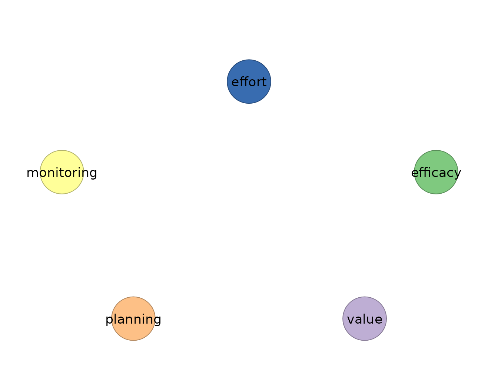
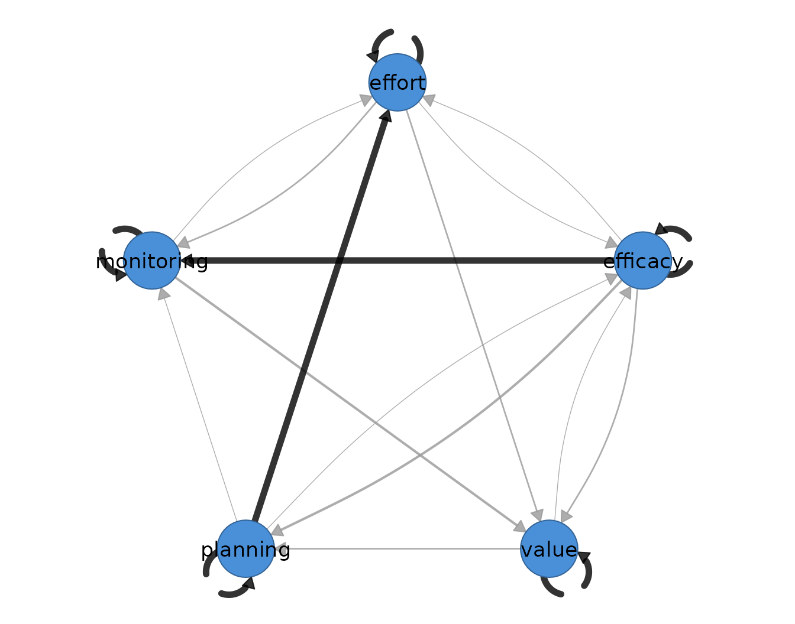

# 11. Package overview: a clean-room methods tour

## Introduction

Idiographic science treats the individual — not the group average — as
the unit of analysis (Molenaar, 2004). Intensive longitudinal designs
such as experience sampling (ESM), ecological momentary assessment
(EMA), and diary studies produce the many-occasions-per-person data this
paradigm requires, and dynamic network models translate those repeated
measurements into interpretable structures: *temporal* networks of
lagged, directed effects, *contemporaneous* networks of same-occasion
partial associations, and *between-person* networks of stable individual
differences (Epskamp, Waldorp, Mõttus, & Borsboom, 2018).

The `idiographic` package implements the principal estimators of this
literature — ordinary and regularized vector autoregression (VAR),
multilevel VAR, Bayesian dynamic structural equation modeling (DSEM),
unified structural equation modeling (uSEM), and Group Iterative
Multiple Model Estimation (GIMME) — together with the methodological
workflow that surrounds them: preprocessing audits, rolling-window
(time-varying) estimation, and structured model comparison. Every
estimator is one verb with named arguments; every result answers
questions through the same tidy accessors:
[`edges()`](https://mohsaqr.github.io/idiographic/reference/edges.md),
[`nodes()`](https://mohsaqr.github.io/idiographic/reference/nodes.md),
[`coefs()`](https://mohsaqr.github.io/idiographic/reference/coefs.md),
[`matrices()`](https://mohsaqr.github.io/idiographic/reference/matrices.md),
[`summary()`](https://rdrr.io/r/base/summary.html), and
[`plot()`](https://rdrr.io/r/graphics/plot.default.html).

## Clean-room implementation

All estimators in `idiographic` are **clean-room reimplementations**:
each was written from the published algorithm — the estimating
equations, model specification, and selection criteria described in the
methodological literature — rather than by wrapping an existing package.
Correctness is then established empirically, by demonstrating numerical
equivalence against the reference implementation on shared data:

| Estimator | Method | Reference implementation | Agreement |
|----|----|----|----|
| [`graphical_var()`](https://mohsaqr.github.io/idiographic/reference/graphical_var.md) | Regularized graphical VAR (graphical lasso + EBIC) | `graphicalVAR` | ~1e-10 |
| [`build_mlvar()`](https://mohsaqr.github.io/idiographic/reference/build_mlvar.md) | Two-step multilevel VAR (`lmer` fixed effects) | `mlVAR` (`estimator = "lmer"`) | machine precision |
| [`build_mlvar_bayes()`](https://mohsaqr.github.io/idiographic/reference/build_mlvar_bayes.md) | Bayesian multilevel VAR / DSEM | Mplus 9 DSEM; independent Stan/JAGS | Monte Carlo error |
| [`build_var_bayes()`](https://mohsaqr.github.io/idiographic/reference/build_var_bayes.md) | Bayesian VAR(1), Normal-inverse-Wishart | Mplus 9 `ESTIMATOR = BAYES` | ~1e-3 |
| [`build_gimme()`](https://mohsaqr.github.io/idiographic/reference/build_gimme.md) | GIMME group + individual search | `gimme` (its own bundled data) | exact path sets and coefficients |
| internal graphical lasso | Friedman, Hastie, & Tibshirani (2008) | `glasso` (KKT-checked) | ~1e-11 |

Two properties follow from this design. First, the runtime dependency
footprint is minimal — the package imports only `stats`, `utils`,
`lme4`, and `lavaan`; the reference packages are needed solely to
regenerate validation fixtures. Second, the Bayesian DSEM estimator
reproduces the two-level Bayesian VAR with latent mean centering that
Mplus fits under `TYPE = TWOLEVEL; ESTIMATOR = BAYES` (Asparouhov,
Hamaker, & Muthén, 2018) **without an Mplus installation**.

## The empirical example

Throughout this vignette we analyze the self-regulated learning (SRL)
experience-sampling data from Chapter 20 of the *Learning Analytics
Methods* book: 36 students each reported nine SRL indicators on 156
occasions. The panel is imported directly from the lamethods data
repository:

``` r

library(rio)
library(idiographic)

df <- import("https://github.com/lamethods/data2/raw/main/srl/srl.RDS")

nrow(df)
#> [1] 5616
length(unique(df$name))
#> [1] 36
```

Rows arrive ordered by student and, within student, by occasion, so the
estimators form lag-1 pairs from consecutive rows within each `id` — no
manual sorting or indexing is required. (The same panel, tidied to the
nine SRL indicators with an explicit `day` occasion index, ships with
the package as `data(srl)` for offline use.)

We follow the package convention of a focused five-indicator set so
printed networks stay readable, and use `Grace` for the single-person
analyses:

``` r

vars <- c("efficacy", "value", "planning", "monitoring", "effort")
has_cograph <- requireNamespace("cograph", quietly = TRUE)
```

## 1. Preprocessing audit — `audit_preprocess()`

Dynamic network estimates are only as sound as the lag-1 design behind
them.
[`audit_preprocess()`](https://mohsaqr.github.io/idiographic/reference/audit_preprocess.md)
constructs the exact lagged design the estimators use and reports
compliance, missingness, day-boundary drops, linear trends,
near-unit-root persistence, and split-half drift — making the modeling
input explicit before any model is fit.

``` r

audit <- audit_preprocess(df, vars = vars, id = "name")

audit
#> Idiographic Preprocessing Audit
#>   Variables:      5 (efficacy, value, planning, monitoring, effort)
#>   Ordered rows:   5616
#>   Retained pairs: 5548
#>   Trend flags:    10
#>   High AR flags:  0
#>   Drift flags:    1
#>   Unit-root risk: 0
#>   Zero variance:  0
#>   Tables:         x$pairs | x$counts | x$diagnostics
```

The subject-by-variable diagnostics are a tidy table:

``` r

head(as.data.frame(audit))
#>   subject   variable   n n_observed missing_prop          mean        sd
#> 1   Aisha   efficacy 156        156            0 -4.105373e-18 0.7864311
#> 2   Aisha      value 156        156            0 -4.863620e-18 0.7808769
#> 3   Aisha   planning 156        156            0 -1.790984e-17 0.7960943
#> 4   Aisha monitoring 156        156            0 -5.486775e-17 0.8119451
#> 5   Aisha     effort 156        156            0  3.560353e-17 0.6716902
#> 6   Alice   efficacy 156        156            0 -2.352076e-17 0.7707262
#>     trend_slope    trend_t    trend_p        ar1     ar1_t      ar1_p
#> 1  0.0020047874  1.4387618 0.15224731 0.17105142 2.1197072 0.03564446
#> 2  0.0028145228  2.0480445 0.04225412 0.19466449 2.4477593 0.01550576
#> 3  0.0033425823  2.3974897 0.01770558 0.01132701 0.1437627 0.88587704
#> 4 -0.0021372375 -1.4862801 0.13924943 0.05212035 0.6457137 0.51943200
#> 5  0.0003149294  0.2629199 0.79296371 0.13136714 1.6434829 0.10233648
#> 6 -0.0004679022 -0.3404868 0.73395399 0.02395697 0.2965123 0.76724098
#>   mean_first_half mean_second_half  mean_shift mean_shift_std mean_shift_p
#> 1     -0.15014485       0.15014485  0.30028969     0.38183852   0.01662736
#> 2     -0.13884210       0.13884210  0.27768420     0.35560563   0.02589611
#> 3     -0.14812463       0.14812463  0.29624926     0.37212836   0.01963663
#> 4      0.05589524      -0.05589524 -0.11179048     0.13768231   0.39162241
#> 5     -0.01096234       0.01096234  0.02192467     0.03264105   0.83926300
#> 6      0.02977691      -0.02977691 -0.05955382     0.07726976   0.63094960
#>   sd_first_half sd_second_half sd_ratio unit_root_coef unit_root_t
#> 1     0.8207057      0.7250859 1.131874     -0.8289486   -10.27252
#> 2     0.7410516      0.7995273 1.078909     -0.8053355   -10.12649
#> 3     0.7874451      0.7818193 1.007196     -0.9886730   -12.54827
#> 4     0.8246748      0.8004082 1.030318     -0.9478796   -11.74318
#> 5     0.5607006      0.7704325 1.374053     -0.8686329   -10.86713
#> 6     0.7751904      0.7700882 1.006625     -0.9760430   -12.08036
#>   flag_zero_variance flag_trend flag_high_ar flag_mean_shift flag_sd_shift
#> 1              FALSE      FALSE        FALSE           FALSE         FALSE
#> 2              FALSE       TRUE        FALSE           FALSE         FALSE
#> 3              FALSE       TRUE        FALSE           FALSE         FALSE
#> 4              FALSE      FALSE        FALSE           FALSE         FALSE
#> 5              FALSE      FALSE        FALSE           FALSE         FALSE
#> 6              FALSE      FALSE        FALSE           FALSE         FALSE
#>   flag_unit_root flag_stationarity_risk
#> 1          FALSE                  FALSE
#> 2          FALSE                   TRUE
#> 3          FALSE                   TRUE
#> 4          FALSE                  FALSE
#> 5          FALSE                  FALSE
#> 6          FALSE                  FALSE
```

## 2. Ordinary VAR — `build_var()`

The transparent baseline: each variable is regressed on an intercept and
the lag-1 values of all variables by ordinary least squares, and the
residual concentration matrix yields the contemporaneous
partial-correlation network. Passing `subject` selects one person’s
series — the caller never slices the data frame.

``` r

var_fit <- build_var(df, vars = vars, id = "name", subject = "Grace",
                     scale = TRUE)

var_fit
#> OLS VAR Result
#>   Variables:      5 (efficacy, value, planning, monitoring, effort)
#>   Observations:   155
#>   Temporal edges: 25 / 25
#>   Contemp edges:  10 / 10
#> 
#>   Temporal [directed]
#>     weights [-0.160, 0.159]  |  +11 / -14 edges
#>                efficacy value planning monitoring effort
#>     efficacy      -0.13  0.04    -0.01      -0.04  -0.09
#>     value         -0.10  0.10     0.09      -0.12   0.13
#>     planning      -0.04 -0.11    -0.01      -0.06   0.16
#>     monitoring     0.05 -0.16    -0.03       0.00   0.00
#>     effort         0.06  0.07     0.11       0.01  -0.02
#> 
#>   Contemporaneous [undirected]
#>     weights [-0.060, 0.467]  |  +6 / -4 edges
#>                efficacy value planning monitoring effort
#>     efficacy       0.00  0.06    -0.06       0.38  -0.03
#>     value          0.06  0.00     0.11       0.10  -0.01
#>     planning      -0.06  0.11     0.00      -0.06   0.33
#>     monitoring     0.38  0.10    -0.06       0.00   0.47
#>     effort        -0.03 -0.01     0.33       0.47   0.00
#> 
#>   plot(x) | plot(x, layer = "temporal") 
#>   edges(x) | nodes(x) | summary(x) | coefs(x) | matrices(x)
```

``` r

head(edges(var_fit))
#>    network       from         to     weight
#> 1 temporal monitoring      value -0.1604470
#> 2 temporal   planning     effort  0.1591502
#> 3 temporal      value     effort  0.1346800
#> 4 temporal      value monitoring -0.1204242
#> 5 temporal   planning      value -0.1098008
#> 6 temporal     effort   planning  0.1080185

summary(var_fit)
#>           network n_nodes n_edges density mean_abs_weight n_positive n_negative
#> 1        temporal       5      20       1      0.07457677          9         11
#> 2 contemporaneous       5      10       1      0.16039547          6          4
```

``` r

plot(var_fit)
```


## 3. Graphical VAR — `graphical_var()`

The regularized counterpart (Epskamp et al., 2018): lasso penalties on
the temporal coefficients and the contemporaneous concentration matrix,
with the penalty pair selected by the extended Bayesian information
criterion (Chen & Chen, 2008). Sparsity — cells estimated as exactly
zero — is the point of the method.

``` r

gvar_fit <- graphical_var(df, vars = vars, id = "name", subject = "Grace",
                          n_lambda = 12, gamma = 0)

gvar_fit
#> Graphical VAR Result
#>   Variables:      5 (efficacy, value, planning, monitoring, effort)
#>   Observations:   155
#>   Temporal edges: 0 / 25
#>   Contemp edges:  3 / 10
#>   EBIC:           698.29 (gamma=0.00)
#>   Lambda:         beta=0.2695, kappa=0.1534
#> 
#>   Temporal [directed]
#>     no non-zero edges
#>                efficacy value planning monitoring effort
#>     efficacy          0     0        0          0      0
#>     value             0     0        0          0      0
#>     planning          0     0        0          0      0
#>     monitoring        0     0        0          0      0
#>     effort            0     0        0          0      0
#> 
#>   Contemporaneous [undirected]
#>     weights [0.184, 0.286]  |  +3 / -0 edges
#>                efficacy value planning monitoring effort
#>     efficacy       0.00     0     0.00       0.26   0.00
#>     value          0.00     0     0.00       0.00   0.00
#>     planning       0.00     0     0.00       0.00   0.18
#>     monitoring     0.26     0     0.00       0.00   0.29
#>     effort         0.00     0     0.18       0.29   0.00
#> 
#>   plot(x) | plot(x, layer = "temporal") 
#>   edges(x) | nodes(x) | summary(x) | coefs(x) | matrices(x)
```

Fixing a penalty instead of searching it (e.g. `lambda_beta = 0.1`)
reproduces published fixed-penalty analyses and collapses the EBIC grid.

``` r

plot(gvar_fit, layer = "temporal")
```



## 4. One network per person — `build_var_each()` / `graphical_var_each()`

When the analysis target is the idiographic map of *every* individual,
fit one model per person. The collection prints a per-cohort summary and
plots any subject by name.

``` r

var_each <- build_var_each(df, vars = vars, id = "name", scale = TRUE)

var_each
#> Idiographic OLS VARs
#>   Subjects:       36
#>   Variables:      5
#>   Lag pairs:      median 155 (range 137-155)
#>   Temporal edges: median 25 (range 25-25)
#>   Access:         x[["Eve"]] | cograph::splot(x[["Eve"]])
```

``` r

plot(var_each, subject = "Grace")
```


[`graphical_var_each()`](https://mohsaqr.github.io/idiographic/reference/graphical_var_each.md)
does the same with sparse estimation; here on a four-student subsample
for speed:

``` r

students4 <- subset(df, name %in% c("Grace", "Eve", "Aisha", "Bob"))

gvar_each <- graphical_var_each(students4, vars = vars, id = "name",
                                n_lambda = 8, gamma = 0)

gvar_each
#> Idiographic graphical VARs
#>   Subjects:               4
#>   Variables:              5
#>   Contemporaneous edges:  median 6 (range 3-9)
#>   Access:                 x[["Eve"]] | cograph::splot(x[["Eve"]])
```

## 5. Multilevel VAR — `build_mlvar()`

The multilevel VAR of Bringmann et al. (2013) and Epskamp et al. (2018)
decomposes the panel into three group-level networks — the average
within-person temporal network, the within-person contemporaneous
network, and the between-person network of person means — estimated with
`lme4` mixed models. This estimator matches
`mlVAR::mlVAR(estimator = "lmer")` to machine precision.

``` r

mlvar_fit <- build_mlvar(df, vars = vars, id = "name", standardize = TRUE)

mlvar_fit
#> mlVAR result: 36 subjects, 5548 observations, 5 variables (lag 1)
#>   Temporal edges significant at p<0.05: 2 / 25
#> 
#>   Temporal [directed]
#>     weights [-0.049, 0.044]  |  +17 / -8 edges
#>                efficacy value planning monitoring effort
#>     efficacy      -0.05  0.01     0.01      -0.01   0.00
#>     value          0.00  0.04     0.01      -0.01   0.03
#>     planning       0.00 -0.01     0.00       0.01  -0.02
#>     monitoring     0.03  0.02     0.01       0.01   0.03
#>     effort         0.01 -0.02     0.00       0.00   0.01
#> 
#>   Contemporaneous [undirected]
#>     weights [0.026, 0.274]  |  +10 / -0 edges
#>                efficacy value planning monitoring effort
#>     efficacy       0.00  0.21     0.24       0.16   0.21
#>     value          0.21  0.00     0.19       0.07   0.13
#>     planning       0.24  0.19     0.00       0.03   0.27
#>     monitoring     0.16  0.07     0.03       0.00   0.14
#>     effort         0.21  0.13     0.27       0.14   0.00
#> 
#>   Between [undirected]
#>     weights [-0.086, 0.553]  |  +8 / -2 edges
#>                efficacy value planning monitoring effort
#>     efficacy       0.00  0.27     0.55       0.11   0.24
#>     value          0.27  0.00    -0.01      -0.09   0.42
#>     planning       0.55 -0.01     0.00       0.00   0.22
#>     monitoring     0.11 -0.09     0.00       0.00   0.18
#>     effort         0.24  0.42     0.22       0.18   0.00
#> 
#>   plot(x) | plot(x, layer = "temporal") | plot(x, layer = "between") 
#>   edges(x) | nodes(x) | summary(x) | coefs(x) | matrices(x)
```

``` r

head(edges(mlvar_fit))
#>    network       from       to      weight
#> 1 temporal monitoring   effort  0.03233503
#> 2 temporal      value   effort  0.02867445
#> 3 temporal monitoring efficacy  0.02724030
#> 4 temporal     effort    value -0.02217274
#> 5 temporal monitoring    value  0.01657931
#> 6 temporal   planning   effort -0.01570680

summary(mlvar_fit)
#>           network n_nodes n_edges density mean_abs_weight n_positive n_negative
#> 1        temporal       5      20       1      0.01237276         14          6
#> 2 contemporaneous       5      10       1      0.16471314         10          0
#> 3         between       5      10       1      0.20864447          8          2
```

``` r

plot(mlvar_fit, layer = "between")
```


## 6. Bayesian multilevel VAR / DSEM — `build_mlvar_bayes()`

A native Bayesian two-level VAR(1) with latent mean centering — the
model Mplus fits as DSEM (Asparouhov et al., 2018) — estimated by a
pure-R conjugate Gibbs sampler with Mplus’s own priors (`N(0, ∞)` on
coefficients and means, improper inverse-Wishart on covariance blocks;
reported estimates are posterior medians). Convergence is monitored with
the potential scale reduction factor across chains.

``` r

bayes_fit <- build_mlvar_bayes(df, vars = vars, id = "name",
                               n_iter = 2000, n_chains = 2, seed = 1)

bayes_fit
#> Bayesian mlVAR (Mplus DSEM equivalent, temporal = fixed): 36 subjects, 5548 observations, 5 variables
#>   MCMC: 2 chains x 2000 iter (1000 burn-in), 2000 draws | max PSR = 1.003
#>   Temporal 95% CIs excluding 0: 2 / 25
#> 
#>   Temporal [directed]
#>     weights [-0.042, 0.051]  |  +18 / -7 edges
#>                efficacy value planning monitoring effort
#>     efficacy      -0.04  0.01     0.01      -0.01   0.00
#>     value          0.00  0.05     0.01      -0.01   0.03
#>     planning       0.00 -0.01     0.00       0.02  -0.02
#>     monitoring     0.03  0.02     0.01       0.01   0.03
#>     effort         0.01 -0.02     0.00       0.00   0.02
#> 
#>   Contemporaneous [undirected]
#>     weights [0.026, 0.274]  |  +10 / -0 edges
#>                efficacy value planning monitoring effort
#>     efficacy       0.00  0.21     0.24       0.16   0.21
#>     value          0.21  0.00     0.19       0.07   0.13
#>     planning       0.24  0.19     0.00       0.03   0.27
#>     monitoring     0.16  0.07     0.03       0.00   0.14
#>     effort         0.21  0.13     0.27       0.14   0.00
#> 
#>   Between [undirected]
#>     weights [-0.088, 0.547]  |  +9 / -1 edges
#>                efficacy value planning monitoring effort
#>     efficacy       0.00  0.27     0.55       0.11   0.24
#>     value          0.27  0.00     0.01      -0.09   0.41
#>     planning       0.55  0.01     0.00       0.01   0.22
#>     monitoring     0.11 -0.09     0.01       0.00   0.17
#>     effort         0.24  0.41     0.22       0.17   0.00
#> 
#>   coefs(x) posterior median/SD/CI | matrices(x) | edges(x) | summary(x)
```

[`coefs()`](https://mohsaqr.github.io/idiographic/reference/coefs.md)
returns posterior medians with posterior SDs, credible intervals, and
one-sided posterior p-values:

``` r

head(coefs(bayes_fit))
#>    outcome  predictor      estimate posterior_sd     ci_lower    ci_upper
#> 1 efficacy   efficacy -0.0421950742   0.01596412 -0.073581974 -0.01080393
#> 2 efficacy      value  0.0005940101   0.01503854 -0.027572446  0.03134113
#> 3 efficacy   planning  0.0014541027   0.01530886 -0.028763484  0.03110887
#> 4 efficacy monitoring  0.0269418589   0.01576636 -0.003176109  0.05996164
#> 5 efficacy     effort  0.0070592834   0.01522580 -0.023071936  0.03717225
#> 6    value   efficacy  0.0112041602   0.01682639 -0.020887250  0.04507832
#>        p significant
#> 1 0.0055        TRUE
#> 2 0.4860       FALSE
#> 3 0.4750       FALSE
#> 4 0.0385       FALSE
#> 5 0.3170       FALSE
#> 6 0.2550       FALSE
```

The full DSEM extensions — person-specific temporal matrices
(`temporal = "random"`), person-specific residual covariances
(`residual = "random"`), within-model imputation of missing observations
(`impute = TRUE`), and Mplus-style time-interval binning (`tinterval`) —
are available through arguments. Identifying the random-effect
covariance under the improper prior requires at least `2(p + p²) + 1`
subjects, so with 36 students we demonstrate random slopes on a
three-variable system (needs 25):

``` r

dsem_fit <- build_mlvar_bayes(df,
                              vars = c("planning", "monitoring", "effort"),
                              id = "name", temporal = "random",
                              n_iter = 2000, n_chains = 2, seed = 1)

dsem_fit
#> Bayesian mlVAR (Mplus DSEM equivalent, temporal = random): 36 subjects, 5562 observations, 3 variables
#>   MCMC: 2 chains x 2000 iter (1000 burn-in), 2000 draws | max PSR = 1.007
#>   Temporal 95% CIs excluding 0: 0 / 9
#>   Random-slope SD range: 0.140 - 0.219 (person-specific temporal)
#> 
#>   Temporal [directed]
#>     weights [-0.015, 0.046]  |  +7 / -2 edges
#>                planning monitoring effort
#>     planning       0.01       0.01  -0.01
#>     monitoring     0.02       0.02   0.05
#>     effort         0.01      -0.01   0.01
#> 
#>   Contemporaneous [undirected]
#>     weights [0.096, 0.405]  |  +3 / -0 edges
#>                planning monitoring effort
#>     planning        0.0        0.1    0.4
#>     monitoring      0.1        0.0    0.2
#>     effort          0.4        0.2    0.0
#> 
#>   Between [undirected]
#>     weights [0.069, 0.613]  |  +3 / -0 edges
#>                planning monitoring effort
#>     planning       0.00       0.07   0.61
#>     monitoring     0.07       0.00   0.21
#>     effort         0.61       0.21   0.00
#> 
#>   coefs(x) posterior median/SD/CI | matrices(x) | edges(x) | summary(x)
```

## 7. Bayesian single-subject VAR — `build_var_bayes()`

The single-level analogue: an exact Normal-inverse-Wishart two-block
sampler for one person’s VAR(1), validated against Mplus
`ESTIMATOR = BAYES`.

``` r

var_bayes_fit <- build_var_bayes(df, vars = vars, id = "name",
                                 subject = "Grace", n_iter = 2000, seed = 1)

var_bayes_fit
#> Bayesian VAR(1) result (unregularized, Mplus-equivalent)
#>   Variables:    5 (efficacy, value, planning, monitoring, effort)
#>   Observations: 155
#>   MCMC: 2 chains x 2000 iter, 2000 draws | max PSR = 1.003
#>   Temporal 95% CIs excluding 0: 0 / 25
#> 
#>   Temporal [directed]
#>     weights [-0.160, 0.162]  |  +11 / -14 edges
#>                efficacy value planning monitoring effort
#>     efficacy      -0.13  0.04    -0.01      -0.05  -0.09
#>     value         -0.10  0.11     0.09      -0.12   0.13
#>     planning      -0.04 -0.11    -0.01      -0.06   0.16
#>     monitoring     0.06 -0.16    -0.04       0.01   0.00
#>     effort         0.06  0.07     0.11       0.01  -0.02
#> 
#>   Contemporaneous [undirected]
#>     weights [-0.059, 0.466]  |  +6 / -4 edges
#>                efficacy value planning monitoring effort
#>     efficacy       0.00  0.06    -0.05       0.37  -0.03
#>     value          0.06  0.00     0.11       0.10  -0.01
#>     planning      -0.05  0.11     0.00      -0.06   0.33
#>     monitoring     0.37  0.10    -0.06       0.00   0.47
#>     effort        -0.03 -0.01     0.33       0.47   0.00
#> 
#>   coefs(x) | matrices(x) | edges(x) | nodes(x) | summary(x)
```

## 8. The Mplus backend — `build_mlvar_mplus()`

For laboratories that hold an Mplus license,
[`build_mlvar_mplus()`](https://mohsaqr.github.io/idiographic/reference/build_mlvar_mplus.md)
drives the genuine Mplus DSEM run through `MplusAutomation` and returns
the same tidy result classes, so native and Mplus estimates are directly
comparable. It is shown, not run, because it requires the external
program:

``` r

mplus_fit <- build_mlvar_mplus(df, vars = vars, id = "name")
```

## 9. Unified SEM — `build_usem()`

uSEM (Kim, Zhu, Chang, Bentler, & Ernst, 2007) places lagged and
contemporaneous paths in a single structural equation model per person,
estimated with `lavaan`. Contemporaneous paths are directed, which
distinguishes it from the partial-correlation representation of the VAR
family.

``` r

students8 <- subset(df, name %in% c("Grace", "Eve", "Aisha", "Alice",
                                    "Bob", "Diana", "Frank", "Heidi"))

usem_fit <- build_usem(students8, vars = vars, id = "name",
                       temporal = "ar", contemporaneous = "none",
                       residual_cov = TRUE, seed = 1)

usem_fit
#> uSEM Result
#>   Subjects:      8 (8 converged)
#>   Variables:     5 (efficacy, value, planning, monitoring, effort)
#>   Observations:  median 155 (range 155-155)
#> 
#>   Temporal [directed]
#>     weights [-0.032, 0.048]  |  +3 / -2 edges
#>                efficacy value planning monitoring effort
#>     efficacy      -0.02  0.00     0.00       0.00   0.00
#>     value          0.00  0.05     0.00       0.00   0.00
#>     planning       0.00  0.00     0.04       0.00   0.00
#>     monitoring     0.00  0.00     0.00      -0.03   0.00
#>     effort         0.00  0.00     0.00       0.00   0.02
#> 
#>   Contemporaneous [directed]
#>     no non-zero edges
#>                efficacy value planning monitoring effort
#>     efficacy          0     0        0          0      0
#>     value             0     0        0          0      0
#>     planning          0     0        0          0      0
#>     monitoring        0     0        0          0      0
#>     effort            0     0        0          0      0
#> 
#>   Residual_cov [undirected]
#>     weights [0.154, 0.395]  |  +10 / -0 edges
#>                efficacy value planning monitoring effort
#>     efficacy       0.00  0.33     0.29       0.27   0.31
#>     value          0.33  0.00     0.26       0.18   0.29
#>     planning       0.29  0.26     0.00       0.16   0.39
#>     monitoring     0.27  0.18     0.16       0.00   0.15
#>     effort         0.31  0.29     0.39       0.15   0.00
#> 
#>   plot(x) | plot(x, layer = "temporal") | plot(x, layer = "contemporaneous") 
#>   edges(x) | nodes(x) | summary(x) | coefs(x) | matrices(x)
```

## 10. GIMME — `build_gimme()`

GIMME (Gates & Molenaar, 2012) searches each individual’s uSEM and
promotes paths carried by a sufficient proportion of the sample to the
group level, yielding a group structure plus person-specific
elaborations. The implementation replicates the `gimme` package exactly
— identical path sets and coefficients on its own bundled benchmark
data.

``` r

gimme_fit <- build_gimme(students8, vars = vars, id = "name",
                         ar = TRUE, groupcutoff = 0.75, seed = 1)

gimme_fit
#> GIMME Network Analysis
#> ------------------------------ 
#> Subjects:   8 
#> Variables:  5  ( efficacy, value, planning, monitoring, effort )
#> AR paths:   yes 
#> Hybrid:     no 
#> 
#> Group-level paths found: 2 
#>    effort~planning 
#>    monitoring~efficacy 
#> 
#> Individual-level paths:  mean 2.5, range 1-4
#> 
#> Proportion of subjects with each path:
#> 
#>   Temporal [directed]
#>     weights [1.000, 1.000]  |  +5 / -0 edges
#>                efficacy value planning monitoring effort
#>     efficacy          1     0        0          0      0
#>     value             0     1        0          0      0
#>     planning          0     0        1          0      0
#>     monitoring        0     0        0          1      0
#>     effort            0     0        0          0      1
#> 
#>   Contemporaneous [directed]
#>     weights [0.125, 1.000]  |  +14 / -0 edges
#>                efficacy value planning monitoring effort
#>     efficacy       0.00  0.25     0.38       1.00   0.12
#>     value          0.12  0.00     0.25       0.00   0.00
#>     planning       0.12  0.00     0.00       0.12   1.00
#>     monitoring     0.00  0.38     0.00       0.00   0.12
#>     effort         0.12  0.25     0.00       0.25   0.00
#> 
#>   plot(x)  (faithful gimme-style mixed network) | plot(x, layer = "temporal") 
#>   edges(x) | nodes(x) | summary(x) | coefs(x) | matrices(x)
```

``` r

head(edges(gimme_fit))
#>           network       from         to weight level
#> 1        temporal   efficacy   efficacy      1 group
#> 2        temporal      value      value      1 group
#> 3        temporal   planning   planning      1 group
#> 4        temporal monitoring monitoring      1 group
#> 5        temporal     effort     effort      1 group
#> 6 contemporaneous   efficacy monitoring      1 group
```

[`plot()`](https://rdrr.io/r/graphics/plot.default.html) draws the
canonical GIMME display: dashed lag-1 edges, solid contemporaneous
edges, width proportional to the share of subjects carrying the path,
black for group-level paths.

``` r

plot(gimme_fit)
```



## 11. Rolling networks — `rolling_var()` / `rolling_graphical_var()`

Rolling-window estimation asks whether one person’s dynamics are
stationary over the study period: the estimator is refit on a moving
slice of the series, and the result is a tidy table of window-by-edge
estimates.

``` r

rolling_fit <- rolling_var(df, vars = vars, id = "name", subject = "Grace",
                           window_size = 50, step = 20, scale = TRUE,
                           keep_fits = TRUE)

rolling_fit
#> Rolling VAR Result
#>   Subjects:   1
#>   Windows:    6
#>   Variables:  5 (efficacy, value, planning, monitoring, effort)
#>   Tables:     x$estimates | x$windows | x$failures
#>   Cograph:    cograph::splot(x$fits[[1]])
#>   Matrices:   matrices(x$fits[[1]])

head(as.data.frame(rolling_fit))
#>   subject window start_row end_row start_day end_day start_beep end_beep
#> 1   Grace      1         1      50      <NA>    <NA>         NA       NA
#> 2   Grace      1         1      50      <NA>    <NA>         NA       NA
#> 3   Grace      1         1      50      <NA>    <NA>         NA       NA
#> 4   Grace      1         1      50      <NA>    <NA>         NA       NA
#> 5   Grace      1         1      50      <NA>    <NA>         NA       NA
#> 6   Grace      1         1      50      <NA>    <NA>         NA       NA
#>    network       from       to     weight
#> 1 temporal   efficacy efficacy -0.2542949
#> 2 temporal      value efficacy  0.0364689
#> 3 temporal   planning efficacy -0.1061240
#> 4 temporal monitoring efficacy -0.2716587
#> 5 temporal     effort efficacy  0.2253335
#> 6 temporal   efficacy    value -0.0111859
```

``` r

plot(rolling_fit, fit = 1, layer = "temporal")
```


[`rolling_graphical_var()`](https://mohsaqr.github.io/idiographic/reference/rolling_graphical_var.md)
provides the sparse analogue with the same interface.

## 12. Model comparison — `compare_idiographic()`

[`compare_idiographic()`](https://mohsaqr.github.io/idiographic/reference/compare_idiographic.md)
runs several estimators on the same data and stacks their summaries into
one comparison table, so estimators are read against each other rather
than assembled by hand. Per-estimator arguments pass through
`estimator_args`.

``` r

cmp <- compare_idiographic(
  df, vars = vars, id = "name",
  estimators = c("var", "graphical_var"),
  estimator_args = list(
    var = list(subject = "Grace", scale = TRUE),
    graphical_var = list(subject = "Grace", n_lambda = 8, gamma = 0)
  )
)

cmp
#> Idiographic Model Comparison
#>   Requested: 2
#>   Successful: 2
#>   Failures:   0
#>   Tables:     x$comparison | x$failures
#>   Fits:       rerun with keep_fits = TRUE for cograph plots

as.data.frame(cmp)
#>          method         network n_nodes n_edges density mean_abs_weight
#> 1           var        temporal       5      20     1.0      0.07457677
#> 2           var contemporaneous       5      10     1.0      0.16039547
#> 3 graphical_var        temporal       5       0     0.0      0.00000000
#> 4 graphical_var contemporaneous       5       3     0.3      0.20679444
#>   n_positive n_negative n_self max_abs_weight
#> 1          9         11      5      0.1604470
#> 2          6          4      0      0.4667434
#> 3          0          0      0      0.0000000
#> 4          3          0      0      0.2514403
```

## One grammar for every result

Every estimator above returned an object obeying the same contract:
`print` shows the estimated networks;
[`edges()`](https://mohsaqr.github.io/idiographic/reference/edges.md),
[`nodes()`](https://mohsaqr.github.io/idiographic/reference/nodes.md),
[`coefs()`](https://mohsaqr.github.io/idiographic/reference/coefs.md),
and
[`matrices()`](https://mohsaqr.github.io/idiographic/reference/matrices.md)
return plain data frames;
[`summary()`](https://rdrr.io/r/base/summary.html) condenses the fit;
[`plot()`](https://rdrr.io/r/graphics/plot.default.html) draws it (via
the optional `cograph` package); and
[`as_netobject()`](https://mohsaqr.github.io/idiographic/reference/as_netobject.md)
converts any result into a network object for further graph-analytic
work. The user never indexes into a result object — when a subset is
needed, it is an argument, not a bracket.

## References

Asparouhov, T., Hamaker, E. L., & Muthén, B. (2018). Dynamic structural
equation models. *Structural Equation Modeling, 25*(3), 359–388.

Bringmann, L. F., Vissers, N., Wichers, M., Geschwind, N., Kuppens, P.,
Peeters, F., Borsboom, D., & Tuerlinckx, F. (2013). A network approach
to psychopathology: New insights into clinical longitudinal data. *PLoS
ONE, 8*(4), e60188.

Chen, J., & Chen, Z. (2008). Extended Bayesian information criteria for
model selection with large model spaces. *Biometrika, 95*(3), 759–771.

Epskamp, S., Waldorp, L. J., Mõttus, R., & Borsboom, D. (2018). The
Gaussian graphical model in cross-sectional and time-series data.
*Multivariate Behavioral Research, 53*(4), 453–480.

Friedman, J., Hastie, T., & Tibshirani, R. (2008). Sparse inverse
covariance estimation with the graphical lasso. *Biostatistics, 9*(3),
432–441.

Gates, K. M., & Molenaar, P. C. M. (2012). Group search algorithm
recovers effective connectivity maps for individuals in homogeneous and
heterogeneous samples. *NeuroImage, 63*(1), 310–319.

Kim, J., Zhu, W., Chang, L., Bentler, P. M., & Ernst, T. (2007). Unified
structural equation modeling approach for the analysis of multisubject
fMRI data. *Human Brain Mapping, 28*(2), 85–93.

Molenaar, P. C. M. (2004). A manifesto on psychology as idiographic
science: Bringing the person back into scientific psychology, this time
forever. *Measurement, 2*(4), 201–218.

*Learning Analytics Methods*, Book 2, Chapter 20: Vector autoregression.
<https://lamethods.org/book2/chapters/ch20-var/ch20-var.html> (source of
the SRL data).
