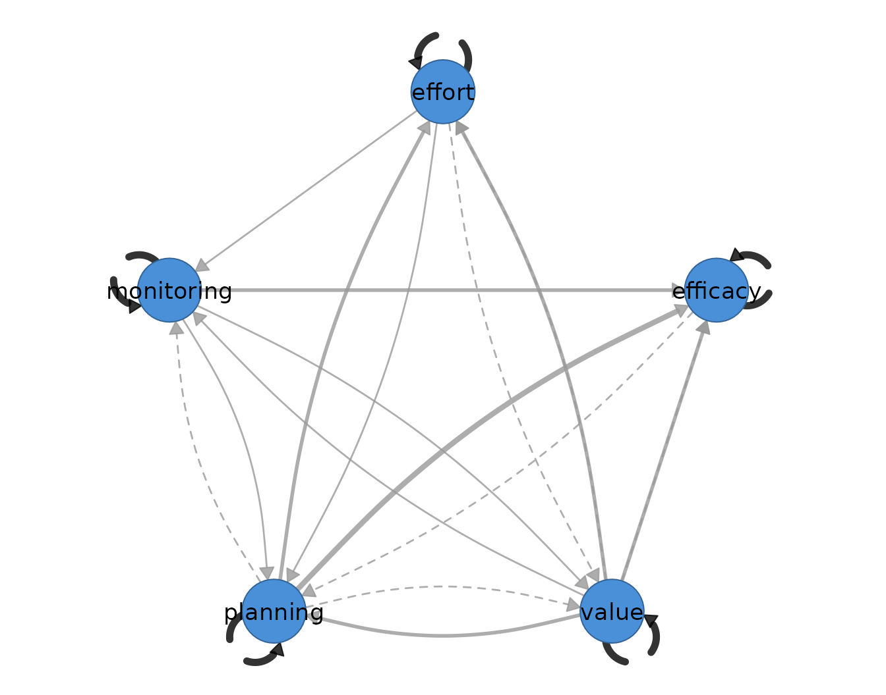
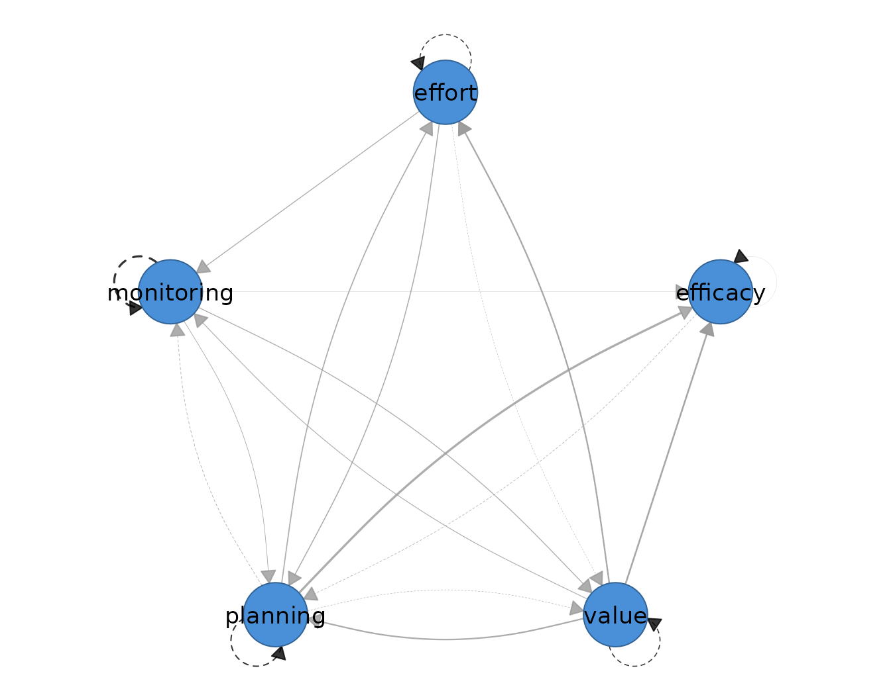

# 8. GIMME

Group iterative multiple model estimation (GIMME) sits at the boundary
of idiographic and group inference. It estimates a person-specific
unified structural equation model for each individual — one structural
model per person, fitted to that person’s own ordered series — while
searching for paths that recur in a sufficient proportion of individuals
and promoting those to a shared group level. The estimand is therefore
double: every subject receives an idiographic dynamic model, and the
group model records which pieces of structure the sample holds in
common. Like the other lag-one models in this package, it presumes
weakly stationary series, linear lag-one dynamics, and correctly
ordered, approximately equally spaced occasions within each person.

Two kinds of within-person path enter the search. A temporal path
`from -> to` is a directed lag-one path within a person’s series: the
value of `from` at occasion $`t-1`$ predicts the value of `to` at
occasion $`t`$, holding the other lagged variables constant. A
contemporaneous path is a directed within-occasion path: `from` predicts
`to` at the same occasion, over and above what the lagged variables
explain. Unlike the graphical VAR, whose contemporaneous layer is an
undirected partial-correlation network, GIMME places directed SEM paths
within an occasion as well as across occasions. The weight displayed on
a GIMME edge is the proportion of subjects whose individual model
carries that path — path prevalence — not a regression coefficient; a
weight of 1 states that every subject has the path and by itself says
nothing about the size or sign of the effect. The per-person
coefficients live in the individual models and are reported separately.

This placement distinguishes GIMME from its neighbours. Multilevel VAR
([`fit_mlvar()`](https://mohsaqr.github.io/idiographic/reference/fit_mlvar.md))
pools all subjects into a single fixed-effect average temporal matrix
and treats person-level departures as random effects around it; GIMME
instead keeps one structural model per person and asks which paths
replicate. Unified SEM
([`fit_usem()`](https://mohsaqr.github.io/idiographic/reference/fit_usem.md))
fits the same person-specific model class for a single subject, with no
group search; GIMME is the multi-subject extension that adds the
replication rule. The method is appropriate when theory expects both
shared pathways and person-specific deviations, and when the question is
which is which.

## Data and preprocessing

The estimator expects long format: one row per person-occasion, an id
column, an ordering column, and numeric time-varying indicators. The
supplied anonymized `esm_srl` data hold momentary
self-regulated-learning indicators for 41 students; `name` identifies
the student and `occasion` orders measurements within student. Five
indicators enter the model: `efficacy`, `value`, `planning`,
`monitoring`, and `effort`. To keep the vignette fast without
hand-picking people for their fitted networks, the example uses the four
students with the most complete five-indicator occasions, breaking ties
alphabetically.

``` r

vars <- c("efficacy", "value", "planning", "monitoring", "effort")
complete_n <- tapply(complete.cases(esm_srl[vars]), esm_srl$name, sum)
selection <- data.frame(subject = names(complete_n),
                        complete = as.integer(complete_n))
selection <- selection[order(-selection$complete, selection$subject), ]
selected_ids <- head(selection$subject, 4)
head(selection, 4)
#>    subject complete
#> 15    Hana       79
#> 17    Iker       79
#> 19   Jamal       79
#> 29    Omar       79
preprocess(esm_srl[esm_srl$name %in% selected_ids, ],
           vars = vars, id = "name")
#> Idiographic Preprocessing
#>   Variables:      5 (efficacy, value, planning, monitoring, effort)
#>   Ordered rows:   316
#>   Retained pairs: 312
#>   Trend flags:    10
#>   High AR flags:  0
#>   Drift flags:    4
#>   Unit-root risk: 0
#>   Zero variance:  0
#>   Tables:         x$pairs | x$counts | x$diagnostics
#> 
#> 10 of 20 subject-series show a trend or unit-root that can bias the temporal network. preprocess() only diagnosed this; to clean just the series that need it, re-run with:
#>   preprocess(data = esm_srl[esm_srl$name %in% selected_ids, ], vars = vars, id = "name", detrend = "auto")
```

The transparent rule selects Hana, Iker, Jamal, and Omar, each with 79
complete five-indicator occasions. The audit is shown rather than
silently assuming stationarity; these supplied series contain trend or
shift flags, so the fit is a method demonstration and its paths should
not be treated as confirmatory substantive findings.

## Fitting the model

The estimator takes the data, the variable set, the id column, and the
time column; `time = "occasion"` orders occasions within each student.
`ar = TRUE` places an autoregressive path on every variable in every
subject’s model from the outset, which anchors the search.
`groupcutoff = 0.75` and `subcutoff = 0.75` require a path to improve
fit in at least 75 percent of the relevant subjects — here, three of the
four — before it is promoted by the corresponding rule.

``` r

students <- esm_srl[esm_srl$name %in% selected_ids, ]
gimme_fit <- fit_gimme(
  students, vars = vars, id = "name", time = "occasion",
  ar = TRUE, groupcutoff = 0.75, subcutoff = 0.75, seed = 1
)
gimme_fit
#> GIMME Network Analysis
#> ------------------------------ 
#> Subjects:   4 
#> Variables:  5  ( efficacy, value, planning, monitoring, effort )
#> AR paths:   yes 
#> Hybrid:     no 
#> 
#> Group-level paths found: 0 
#> 
#> Individual-level paths:  mean 6.0, range 4-9
#> 
#> Proportion of subjects with each path:
#> 
#>   Temporal [directed]
#>     weights [0.250, 1.000]  |  +11 / -0 edges
#>                efficacy value planning monitoring effort
#>     efficacy       1.00  0.00     0.25       0.00   0.00
#>     value          0.25  1.00     0.00       0.00   0.25
#>     planning       0.00  0.25     1.00       0.25   0.00
#>     monitoring     0.00  0.00     0.00       1.00   0.00
#>     effort         0.00  0.25     0.00       0.00   1.00
#> 
#>   Contemporaneous [directed]
#>     weights [0.250, 0.750]  |  +11 / -0 edges
#>                efficacy value planning monitoring effort
#>     efficacy       0.00  0.00     0.00       0.00    0.0
#>     value          0.50  0.00     0.50       0.25    0.5
#>     planning       0.75  0.00     0.00       0.00    0.5
#>     monitoring     0.50  0.25     0.25       0.00    0.0
#>     effort         0.00  0.00     0.25       0.25    0.0
#> 
#>   plot(x)  (faithful gimme-style mixed network) | plot(x, layer = "temporal") 
#>   edges(x) | nodes(x) | summary(x) | coefs(x) | matrices(x)
```

No cross-variable path reaches the 75 percent group threshold. The five
autoregressive paths are fixed by `ar = TRUE` and carried by all four
students; all selected cross-variable paths are individual-level. This
is a result of the stated rule and cutoffs, not a claim that the
population has no shared dynamics. The fitted temporal and
contemporaneous prevalence matrices range from 0.25 (one student) to
0.75 (three students) off the diagonal.

## Reading the output

The [`summary()`](https://rdrr.io/r/base/summary.html) method reports
one row per network layer, counting cross-variable edges only.

``` r

summary(gimme_fit)
#>           network n_nodes n_edges density mean_abs_weight n_positive n_negative
#> 1        temporal       5       6    0.30       0.2500000          6          0
#> 2 contemporaneous       5      11    0.55       0.4090909         11          0
```

The temporal layer holds six cross-variable edges at density 0.30 and
mean prevalence 0.250; the contemporaneous layer holds 11 directed edges
at density 0.55 and mean prevalence 0.409. The
[`edges()`](https://mohsaqr.github.io/idiographic/reference/edges.md)
accessor lists every retained path with its layer, prevalence, and
level.

``` r

edges(gimme_fit)
#>            network       from         to weight      level
#> 1         temporal   efficacy   efficacy   1.00      group
#> 2         temporal      value      value   1.00      group
#> 3         temporal   planning   planning   1.00      group
#> 4         temporal monitoring monitoring   1.00      group
#> 5         temporal     effort     effort   1.00      group
#> 6  contemporaneous   planning   efficacy   0.75 individual
#> 7  contemporaneous      value   efficacy   0.50 individual
#> 8  contemporaneous      value   planning   0.50 individual
#> 9  contemporaneous      value     effort   0.50 individual
#> 10 contemporaneous   planning     effort   0.50 individual
#> 11 contemporaneous monitoring   efficacy   0.50 individual
#> 12        temporal   efficacy   planning   0.25 individual
#> 13        temporal      value   efficacy   0.25 individual
#> 14        temporal      value     effort   0.25 individual
#> 15        temporal   planning      value   0.25 individual
#> 16        temporal   planning monitoring   0.25 individual
#> 17        temporal     effort      value   0.25 individual
#> 18 contemporaneous      value monitoring   0.25 individual
#> 19 contemporaneous monitoring      value   0.25 individual
#> 20 contemporaneous monitoring   planning   0.25 individual
#> 21 contemporaneous     effort   planning   0.25 individual
#> 22 contemporaneous     effort monitoring   0.25 individual
```

The first five temporal rows are the fixed autoregressive self paths at
prevalence 1. Every cross-variable row is individual-level. The most
prevalent contemporaneous path is planning to efficacy, present in three
of the four students; the most prevalent cross-lagged paths occur in one
of the four students.

``` r

head(coefs(gimme_fit))
#>   subject         network       from         to  weight
#> 1   Jamal        temporal   efficacy   efficacy -0.1262
#> 2   Jamal        temporal      value      value -0.0100
#> 3   Jamal        temporal   planning   planning  0.0769
#> 4   Jamal        temporal monitoring monitoring  0.1087
#> 5   Jamal        temporal     effort     effort  0.0998
#> 6   Jamal contemporaneous      value   efficacy  0.6310
nodes(gimme_fit)
#>            network       node strength out_strength in_strength self
#> 1         temporal   efficacy     0.50         0.25        0.25    1
#> 2         temporal      value     1.00         0.50        0.50    1
#> 3         temporal   planning     0.75         0.50        0.25    1
#> 4         temporal monitoring     0.25         0.00        0.25    1
#> 5         temporal     effort     0.50         0.25        0.25    1
#> 6  contemporaneous   efficacy     1.75         0.00        1.75    0
#> 7  contemporaneous      value     2.00         1.75        0.25    0
#> 8  contemporaneous   planning     2.25         1.25        1.00    0
#> 9  contemporaneous monitoring     1.50         1.00        0.50    0
#> 10 contemporaneous     effort     1.50         0.50        1.00    0
```

[`coefs()`](https://mohsaqr.github.io/idiographic/reference/coefs.md)
supplies the person-specific estimates that the prevalence display
abstracts away: one row per subject, layer, and path. The displayed rows
begin with Jamal and show why prevalence and coefficient magnitude are
separate quantities. The
[`nodes()`](https://mohsaqr.github.io/idiographic/reference/nodes.md)
table sums prevalence over incident edges. Planning is the most
connected contemporaneous node (strength 2.25), while value is most
connected temporally (strength 1.00); the `self` column separately
records autoregressive prevalence 1 for every variable.

``` r

matrices(gimme_fit)
#> 
#> $temporal_counts
#>            efficacy value planning monitoring effort
#> efficacy          4     1        0          0      0
#> value             0     4        1          0      1
#> planning          1     0        4          0      0
#> monitoring        0     0        1          4      0
#> effort            0     1        0          0      4
#> 
#> $temporal_avg
#>            efficacy  value planning monitoring effort
#> efficacy      0.013  0.084    0.000      0.000  0.000
#> value         0.000  0.142    0.058      0.000 -0.050
#> planning     -0.070  0.000    0.182      0.000  0.000
#> monitoring    0.000  0.000   -0.078      0.291  0.000
#> effort        0.000 -0.070    0.000      0.000  0.131
#> 
#> $contemporaneous_counts
#>            efficacy value planning monitoring effort
#> efficacy          0     2        3          2      0
#> value             0     0        0          1      0
#> planning          0     2        0          1      1
#> monitoring        0     1        0          0      1
#> effort            0     2        2          0      0
#> 
#> $contemporaneous_avg
#>            efficacy value planning monitoring effort
#> efficacy          0 0.241    0.302      0.027  0.000
#> value             0 0.000    0.000      0.119  0.000
#> planning          0 0.207    0.000     -0.083  0.140
#> monitoring        0 0.104    0.000      0.000  0.121
#> effort            0 0.213    0.155      0.000  0.000
#> 
#> $path_counts
#>            efficacylag valuelag planninglag monitoringlag effortlag efficacy
#> efficacy             4        1           0             0         0        0
#> value                0        4           1             0         1        0
#> planning             1        0           4             0         0        0
#> monitoring           0        0           1             4         0        0
#> effort               0        1           0             0         4        0
#>            value planning monitoring effort
#> efficacy       2        3          2      0
#> value          0        0          1      0
#> planning       2        0          1      1
#> monitoring     1        0          0      1
#> effort         2        2          0      0
#> 
#> $contemp_cov
#>            efficacy value planning monitoring effort
#> efficacy          0     0        0          0      0
#> value             0     0        0          0      0
#> planning          0     0        0          0      0
#> monitoring        0     0        0          0      0
#> effort            0     0        0          0      0
#> 
#> $contemp_cov_avg
#>            efficacy value planning monitoring effort
#> efficacy          0     0        0          0      0
#> value             0     0        0          0      0
#> planning          0     0        0          0      0
#> monitoring        0     0        0          0      0
#> effort            0     0        0          0      0
```

[`matrices()`](https://mohsaqr.github.io/idiographic/reference/matrices.md)
returns the count and sample-average coefficient matrices behind these
tables, with outcomes on the rows and predictors on the columns. The
temporal count matrix has 4 on its diagonal and at most 1 in an
off-diagonal cell; the contemporaneous count matrix reaches 3. The
average coefficient matrices put magnitude beside recurrence; for
example, the planning-to-efficacy contemporaneous path appears in three
students and averages 0.302 across all four. A path can therefore be
common and weak, so prevalence and magnitude have to be read together,
and neither should be mistaken for a standardized effect size.

## Visualizing the network

Plotting the fit draws the mixed network in the convention of the
`gimme` package: a single panel over the five nodes in which dashed
edges are lag-one temporal paths, solid edges are contemporaneous paths,
black edges belong to the group model, grey edges are individual-level,
and edge width scales with the weight. Under the default
`weight = "prop"` the width is path prevalence.

``` r

plot(gimme_fit, weight = "prop")
```



The dashed black self-loops constitute the fixed group structure; the
grey arrows are individual-level paths, drawn in proportion to how many
students carry them.

``` r

plot(gimme_fit, weight = "coef")
```



Reweighting by `weight = "coef"` keeps the same graph but scales width
by the sample-average coefficient, so the display answers how large
rather than how common. This view must still be read beside the count
matrix because an average over all eight students can be small even when
the fitted coefficients among the students carrying a path are sizeable.

## References
