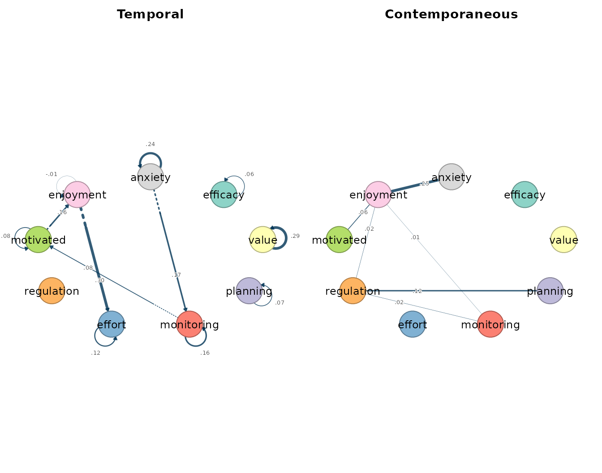
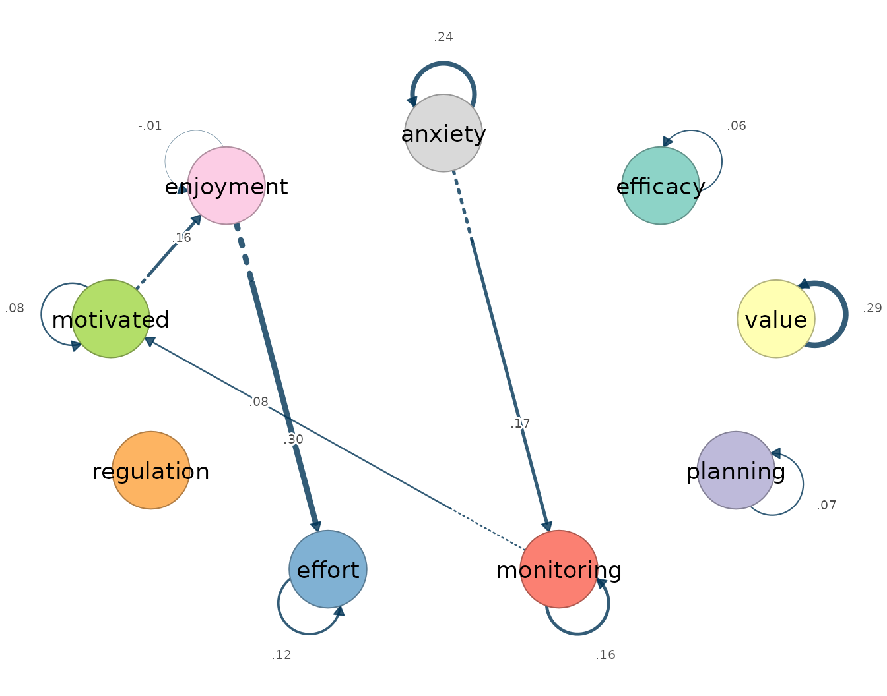
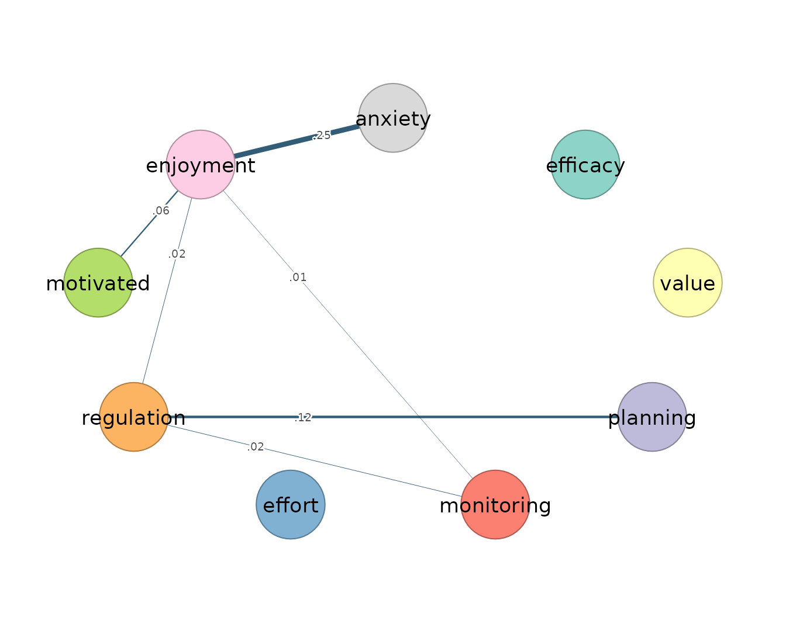
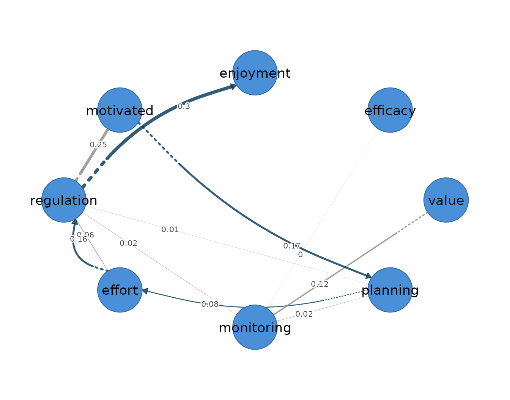

# 4. Graphical VAR

The graphical vector autoregression models one person’s multivariate
series as a first-order Gaussian process, in which each occasion’s
measurements are determined jointly by the values of all variables one
occasion earlier and by the associations that remain among the variables
within the same occasion. It is an idiographic model, estimated for a
single individual, on the premise that within-person dynamics need not
match the between-person structure of the group. It presumes weak
stationarity, meaning that the mean, variance, and autocovariance of
every series are constant across the observation window; linear, lag-one
dynamics; approximately Gaussian fluctuations; and equally spaced
measurement occasions. To these it adds a structural assumption of its
own — sparsity — namely that many of the possible associations are
genuinely absent, and that estimation should recover which ones.

The model yields two networks over the same variables ([Epskamp et al.
2018](#ref-epskamp2018mlvar)). The temporal network is directed: an edge
`from -> to` states that the value of `from` at occasion $`t-1`$
predicts the value of `to` at occasion $`t`$, holding the other lagged
variables constant, so that each arrow is a claim about lag-one
prediction rather than co-occurrence. The contemporaneous network is
undirected: after the previous occasion has explained what it can, the
part of each variable left unexplained — its innovation — may still be
associated with the innovations of the others, and the contemporaneous
edges are the partial correlations among these remainders, the
within-occasion associations that lagged prediction does not account
for.

[`fit_graphical_var()`](https://mohsaqr.github.io/idiographic/reference/fit_graphical_var.md)
estimates both networks jointly by a penalized two-step procedure: a
lasso-penalized regression estimates the lagged effects, a graphical
lasso estimates the within-occasion associations from the residuals of
that regression, and the two steps alternate until the solution
stabilizes. The strength of the penalty is selected by the extended
Bayesian information criterion, whose conservatism is governed by a
parameter that charges for every retained edge. This is what
distinguishes the graphical estimator from the ordinary VAR fitted by
[`fit_var()`](https://mohsaqr.github.io/idiographic/reference/fit_var.md),
which returns a coefficient in every cell of both networks and leaves
the analyst to judge which small values are noise. Under the penalty,
weak edges are shrunk to exactly zero, so an absent edge is a
model-selected absence rather than a small estimate the reader rounds
away; the cost is a downward bias on the weights of the edges that
survive.

## Data and preprocessing

The `esm_srl` data are the supplied anonymized momentary
self-regulated-learning, motivation, and anxiety ratings for 41
students, each assessed repeatedly during a study. This vignette keeps
the established worked example: Quinn on all nine indicators. Quinn was
chosen for this deliberately edge-rich demonstration; the choice is not
a population-sampling rule and must not be used as evidence that every
participant has a non-empty temporal network. Because the penalty does
not protect against a violated stationarity assumption — a trend
inflates the lagged coefficients whether or not they are penalized — the
stationarity screen precedes the fit.

``` r

preprocess(esm_srl, vars = vars, id = "name", subject = "Quinn")
#> Idiographic Preprocessing
#>   Variables:      9 (efficacy, value, planning, monitoring, effort, regulation, motivated, enjoyment, anxiety)
#>   Ordered rows:   79
#>   Retained pairs: 78
#>   Trend flags:    6
#>   High AR flags:  0
#>   Drift flags:    1
#>   Unit-root risk: 0
#>   Zero variance:  0
#>   Tables:         x$pairs | x$counts | x$diagnostics
#> 
#> 6 of 9 subject-series show a trend or unit-root that can bias the temporal network. preprocess() only diagnosed this; to clean just the series that need it, re-run with:
#>   preprocess(data = esm_srl, vars = vars, id = "name", subject = "Quinn", detrend = "auto")
```

Quinn contributes 79 occasions, of which 78 form complete current/lagged
pairs. Six of the nine series carry a linear-trend flag. The model below
is therefore a worked API and interpretation example, not a confirmatory
analysis of Quinn’s dynamics. A substantive analysis should resolve the
flagged non-stationarity and report a detrending sensitivity analysis
before interpreting the temporal edges.

## Fitting the model

Two non-default arguments make this an intentionally sensitive
demonstration. `penalize_diagonal = FALSE` exempts the autoregressions
from the lasso penalty; the default penalizes them along with the
cross-lags, which shrinks the carry-over of each variable — often the
most robust temporal effect — to zero. `gamma = 0.1` is a less
conservative selection threshold than the default of 0.5. These settings
preserve the established non-empty worked network, but they are stated
explicitly so that it cannot be mistaken for an outcome-neutral default
fit. The selected edges belong to the more sensitive, less specific end
of the selection scale.

``` r

fit <- fit_graphical_var(esm_srl, vars = vars, id = "name", subject = "Quinn",
                         penalize_diagonal = FALSE, gamma = 0.1,
                         n_lambda = 8)
fit
#> Graphical VAR Result
#>   Variables:      9 (efficacy, value, planning, monitoring, effort, regulation, motivated, enjoyment, anxiety)
#>   Lags:           1
#>   Observations:   78
#>   Temporal edges: 13 / 81
#>   Contemp edges:  7 / 36
#>   EBIC:           611.06 (gamma=0.10)
#>   Lambda:         beta=0.2749, kappa=0.2221
#> 
#>   Temporal [directed]
#>     weights [-0.008, 0.299]  |  +11 / -2 edges
#>                efficacy value planning monitoring effort regulation motivated
#>     efficacy       0.06  0.00     0.00       0.00   0.00          0      0.00
#>     value          0.00  0.29     0.00       0.00   0.00          0      0.00
#>     planning       0.00  0.00     0.07       0.00   0.00          0      0.00
#>     monitoring     0.00  0.00     0.00       0.16   0.00          0      0.08
#>     effort         0.00  0.00     0.00       0.00   0.12          0      0.00
#>     regulation     0.00  0.00     0.00       0.00   0.00          0      0.00
#>     motivated      0.00  0.00     0.00       0.00   0.00          0      0.08
#>     enjoyment      0.00  0.00     0.00       0.00   0.30          0      0.00
#>     anxiety        0.00  0.00     0.00       0.17   0.00          0      0.00
#>                enjoyment anxiety
#>     efficacy        0.00    0.00
#>     value           0.00    0.00
#>     planning        0.00    0.00
#>     monitoring      0.00    0.00
#>     effort          0.00    0.00
#>     regulation      0.00    0.00
#>     motivated       0.16    0.00
#>     enjoyment      -0.01    0.00
#>     anxiety         0.00    0.24
#> 
#>   Contemporaneous [undirected]
#>     weights [0.002, 0.255]  |  +7 / -0 edges
#>                efficacy value planning monitoring effort regulation motivated
#>     efficacy          0     0     0.00       0.00      0       0.00      0.00
#>     value             0     0     0.00       0.00      0       0.00      0.00
#>     planning          0     0     0.00       0.00      0       0.12      0.00
#>     monitoring        0     0     0.00       0.00      0       0.02      0.00
#>     effort            0     0     0.00       0.00      0       0.00      0.00
#>     regulation        0     0     0.12       0.02      0       0.00      0.00
#>     motivated         0     0     0.00       0.00      0       0.00      0.00
#>     enjoyment         0     0     0.00       0.01      0       0.02      0.06
#>     anxiety           0     0     0.00       0.00      0       0.00      0.00
#>                enjoyment anxiety
#>     efficacy        0.00    0.00
#>     value           0.00    0.00
#>     planning        0.00    0.00
#>     monitoring      0.01    0.00
#>     effort          0.00    0.00
#>     regulation      0.02    0.00
#>     motivated       0.06    0.00
#>     enjoyment       0.00    0.25
#>     anxiety         0.25    0.00
#> 
#>   plot(x) | plot(x, layer = "temporal") 
#>   edges(x) | nodes(x) | summary(x) | coefs(x) | matrices(x)
```

The model is estimated on 78 lagged pairs. It retains four directed
cross-lagged temporal edges and the nine autoregressions, together with
seven contemporaneous partial correlations.

## Reading the output

The [`summary()`](https://rdrr.io/r/base/summary.html) method reports
one row per network layer, with the edge count, density, mean absolute
weight, and the split of positive and negative edges.

``` r

summary(fit)
#>           network n_nodes n_edges    density mean_abs_weight n_positive
#> 1        temporal       9       4 0.05555556      0.17816759          4
#> 2 contemporaneous       9       7 0.19444444      0.06974497          7
#>   n_negative
#> 1          0
#> 2          0
```

The temporal layer holds four cross-lagged edges (density 0.056, mean
absolute weight 0.178) and the contemporaneous layer seven (density
0.194, mean absolute weight 0.070); every retained edge in both layers
is positive.

``` r

edges(fit, network = "temporal", n = 5)
#>    network       from         to     weight
#> 1 temporal  enjoyment     effort 0.29916373
#> 2 temporal    anxiety monitoring 0.17031855
#> 3 temporal  motivated  enjoyment 0.16390707
#> 4 temporal monitoring  motivated 0.07928101
```

The directed temporal edges describe a motivation-to-regulation
sequence. Enjoyment at one occasion predicts higher effort regulation at
the next (0.30), feeling motivated predicts later enjoyment (0.16), and
monitoring predicts later motivation (0.08); anxiety predicts higher
subsequent monitoring (0.17), a within-person coupling of momentary
anxiety to the regulation that follows it.

``` r

edges(fit, network = "contemporaneous", n = 8)
#>           network       from         to      weight
#> 1 contemporaneous  enjoyment    anxiety 0.254827050
#> 2 contemporaneous   planning regulation 0.121800007
#> 3 contemporaneous  motivated  enjoyment 0.056542219
#> 4 contemporaneous regulation  enjoyment 0.022803843
#> 5 contemporaneous monitoring regulation 0.020570876
#> 6 contemporaneous monitoring  enjoyment 0.009411124
#> 7 contemporaneous      value regulation 0.002259688
```

The within-occasion structure is anchored by a positive
enjoyment–anxiety partial correlation (0.26) and a planning–regulation
coupling (0.12), with enjoyment and regulation connecting the motivation
and self-regulation clusters in the same moment.

``` r

nodes(fit)
#>            network       node    strength out_strength in_strength         self
#> 1         temporal   efficacy 0.000000000   0.00000000  0.00000000  0.057423873
#> 2         temporal      value 0.000000000   0.00000000  0.00000000  0.290246122
#> 3         temporal   planning 0.000000000   0.00000000  0.00000000  0.067762154
#> 4         temporal monitoring 0.249599566   0.07928101  0.17031855  0.158372764
#> 5         temporal     effort 0.299163733   0.00000000  0.29916373  0.120337048
#> 6         temporal regulation 0.000000000   0.00000000  0.00000000 -0.002027966
#> 7         temporal  motivated 0.243188083   0.16390707  0.07928101  0.079687240
#> 8         temporal  enjoyment 0.463070804   0.29916373  0.16390707 -0.008308922
#> 9         temporal    anxiety 0.170318554   0.17031855  0.00000000  0.239278152
#> 10 contemporaneous   efficacy 0.000000000           NA          NA  0.000000000
#> 11 contemporaneous      value 0.002259688           NA          NA  0.000000000
#> 12 contemporaneous   planning 0.121800007           NA          NA  0.000000000
#> 13 contemporaneous monitoring 0.029982000           NA          NA  0.000000000
#> 14 contemporaneous     effort 0.000000000           NA          NA  0.000000000
#> 15 contemporaneous regulation 0.167434414           NA          NA  0.000000000
#> 16 contemporaneous  motivated 0.056542219           NA          NA  0.000000000
#> 17 contemporaneous  enjoyment 0.343584235           NA          NA  0.000000000
#> 18 contemporaneous    anxiety 0.254827050           NA          NA  0.000000000
```

[`nodes()`](https://mohsaqr.github.io/idiographic/reference/nodes.md)
separates each variable’s outgoing and incoming cross-lagged strength
from its autoregression, and gives its total strength in the undirected
contemporaneous layer. Enjoyment is the busiest node across both layers,
receiving and sending temporal edges and anchoring the contemporaneous
cluster.

## Visualizing the network

The [`plot()`](https://rdrr.io/r/graphics/plot.default.html) method
draws every network in the result, and passing `layer=` isolates one.
Arrows in the temporal panel encode lag-one prediction; edge width
scales with absolute weight and colour encodes sign.

``` r

plot(fit)
```



``` r

plot(fit, layer = "temporal")
```



The temporal graph is directed and sparse, tracing the
motivation-to-regulation sequence the edge table quantified.

``` r

plot(fit, layer = "contemporaneous")
```



The contemporaneous graph is undirected, with enjoyment and regulation
at the junction of the momentary motivation and self-regulation
associations.

Because the result combines a directed temporal layer and an undirected
contemporaneous layer, it is itself a mixed network, and
`plot(fit, mixed = TRUE)` draws both in one graph: the lag-one effects
as curved arrows and the contemporaneous partial correlations as
straight edges.

``` r

plot(fit, mixed = TRUE)
```



## References

Epskamp, Sacha, Lourens J. Waldorp, René Mõttus, and Denny Borsboom.
2018. “The Gaussian Graphical Model in Cross-Sectional and Time-Series
Data.” *Multivariate Behavioral Research* 53 (4): 453–80.
