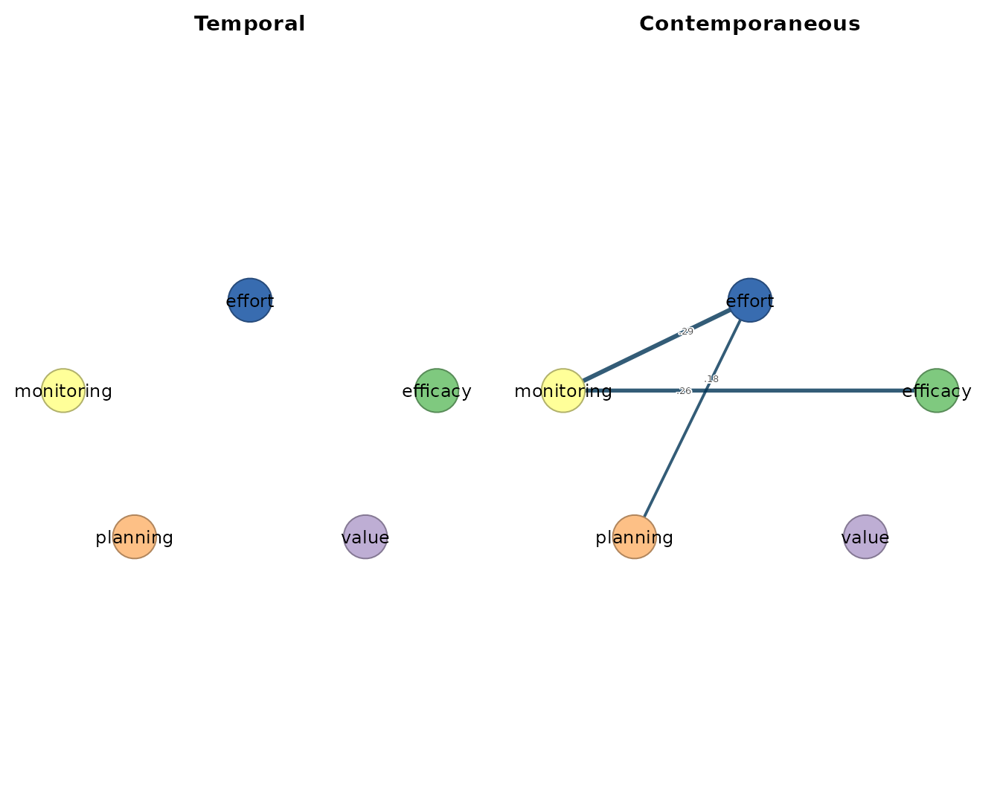
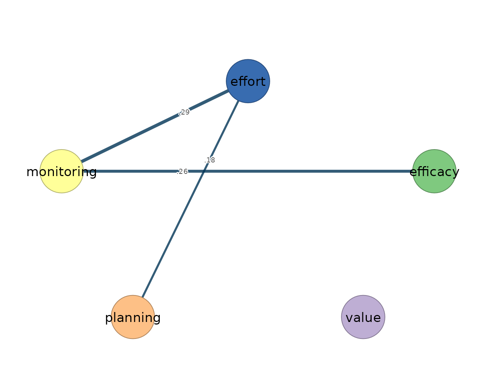

# 3. Graphical VAR

``` r

library(idiographic)
data(srl)
vars <- c("efficacy", "value", "planning", "monitoring", "effort")
has_cograph <- requireNamespace("cograph", quietly = TRUE)
```

[`graphical_var()`](https://mohsaqr.github.io/idiographic/reference/graphical_var.md)
estimates **sparse** temporal and contemporaneous networks with lasso
regularization and EBIC model selection. It is the closest analogue to
the chapter’s graphical VAR section, and the regularized counterpart to
the OLS baseline in the *Ordinary VAR* vignette.

## Fit one person

``` r

gvar_fit <- graphical_var(srl, vars = vars, id = "name", subject = "Grace",
                          n_lambda = 12, gamma = 0)

gvar_fit
#> Graphical VAR Result
#>   Variables:      5 (efficacy, value, planning, monitoring, effort)
#>   Observations:   155
#>   Temporal edges: 0 / 25
#>   Contemp edges:  3 / 10
#>   EBIC:           698.29 (gamma=0.00)
#>   Lambda:         beta=0.2695, kappa=0.1534
#> 
#>   Temporal [directed]
#>     no non-zero edges
#>                efficacy value planning monitoring effort
#>     efficacy          0     0        0          0      0
#>     value             0     0        0          0      0
#>     planning          0     0        0          0      0
#>     monitoring        0     0        0          0      0
#>     effort            0     0        0          0      0
#> 
#>   Contemporaneous [undirected]
#>     weights [0.184, 0.286]  |  +3 / -0 edges
#>                efficacy value planning monitoring effort
#>     efficacy       0.00     0     0.00       0.26   0.00
#>     value          0.00     0     0.00       0.00   0.00
#>     planning       0.00     0     0.00       0.00   0.18
#>     monitoring     0.26     0     0.00       0.00   0.29
#>     effort         0.00     0     0.18       0.29   0.00
#> 
#>   plot(x) | plot(x, layer = "temporal") 
#>   edges(x) | nodes(x) | summary(x) | coefs(x) | matrices(x)
```

The printout reports the selected EBIC, `gamma`, and the two tuning
parameters, then shows the sparse temporal and contemporaneous networks.
Many cells are exactly zero — that sparsity is the point of the method.

## Tidy tables

``` r

head(edges(gvar_fit))
#>           network       from         to    weight
#> 1 contemporaneous monitoring     effort 0.2861771
#> 2 contemporaneous   efficacy monitoring 0.2585143
#> 3 contemporaneous   planning     effort 0.1838825

nodes(gvar_fit)
#>            network       node  strength out_strength in_strength self
#> 1         temporal   efficacy 0.0000000            0           0    0
#> 2         temporal      value 0.0000000            0           0    0
#> 3         temporal   planning 0.0000000            0           0    0
#> 4         temporal monitoring 0.0000000            0           0    0
#> 5         temporal     effort 0.0000000            0           0    0
#> 6  contemporaneous   efficacy 0.2585143           NA          NA    0
#> 7  contemporaneous      value 0.0000000           NA          NA    0
#> 8  contemporaneous   planning 0.1838825           NA          NA    0
#> 9  contemporaneous monitoring 0.5446914           NA          NA    0
#> 10 contemporaneous     effort 0.4700596           NA          NA    0

summary(gvar_fit)
#>           network n_nodes n_edges density mean_abs_weight n_positive n_negative
#> 1        temporal       5       0     0.0        0.000000          0          0
#> 2 contemporaneous       5       3     0.3        0.242858          3          0
```

``` r

matrices(gvar_fit)
#> 
#> $beta
#>              [,1] [,2] [,3] [,4] [,5] [,6]
#> efficacy   -0.003    0    0    0    0    0
#> value       0.008    0    0    0    0    0
#> planning   -0.005    0    0    0    0    0
#> monitoring  0.000    0    0    0    0    0
#> effort      0.010    0    0    0    0    0
#> 
#> $temporal
#>            efficacy value planning monitoring effort
#> efficacy          0     0        0          0      0
#> value             0     0        0          0      0
#> planning          0     0        0          0      0
#> monitoring        0     0        0          0      0
#> effort            0     0        0          0      0
#> 
#> $kappa
#>            efficacy value planning monitoring effort
#> efficacy      1.080 0.000    0.000     -0.292  0.000
#> value         0.000 1.011    0.000      0.000  0.000
#> planning      0.000 0.000    1.043      0.000 -0.202
#> monitoring   -0.292 0.000    0.000      1.179 -0.334
#> effort        0.000 0.000   -0.202     -0.334  1.157
#> 
#> $PCC
#>            efficacy value planning monitoring effort
#> efficacy      0.000     0    0.000      0.259  0.000
#> value         0.000     0    0.000      0.000  0.000
#> planning      0.000     0    0.000      0.000  0.184
#> monitoring    0.259     0    0.000      0.000  0.286
#> effort        0.000     0    0.184      0.286  0.000
#> 
#> $PDC
#>            efficacy value planning monitoring effort
#> efficacy          0     0        0          0      0
#> value             0     0        0          0      0
#> planning          0     0        0          0      0
#> monitoring        0     0        0          0      0
#> effort            0     0        0          0      0
```

## Plot

``` r

plot(gvar_fit)
```



``` r

plot(gvar_fit, layer = "temporal")
```


``` r

plot(gvar_fit, layer = "contemporaneous")
```


