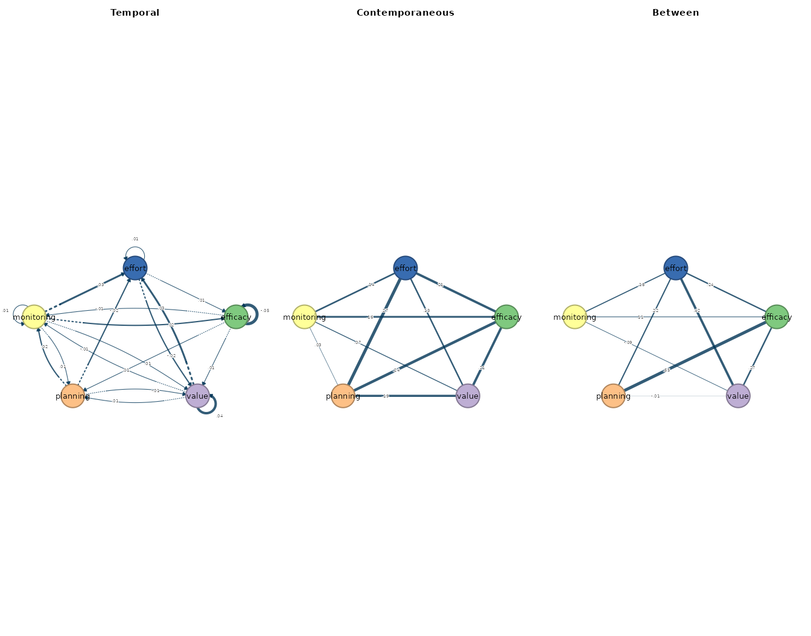
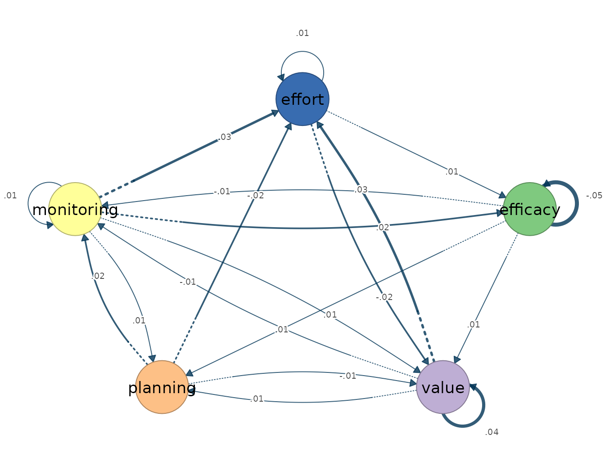
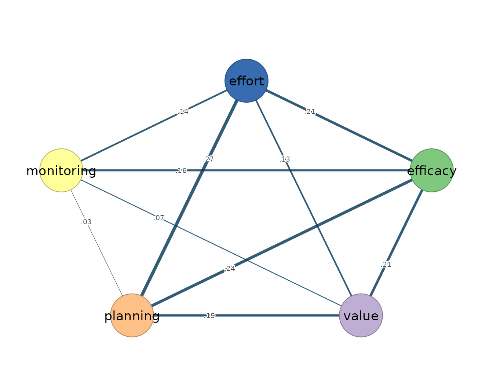
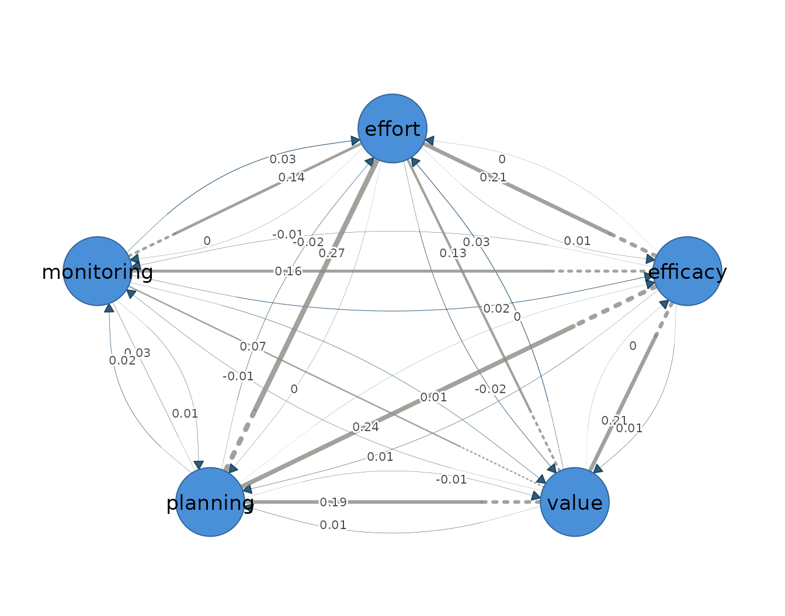
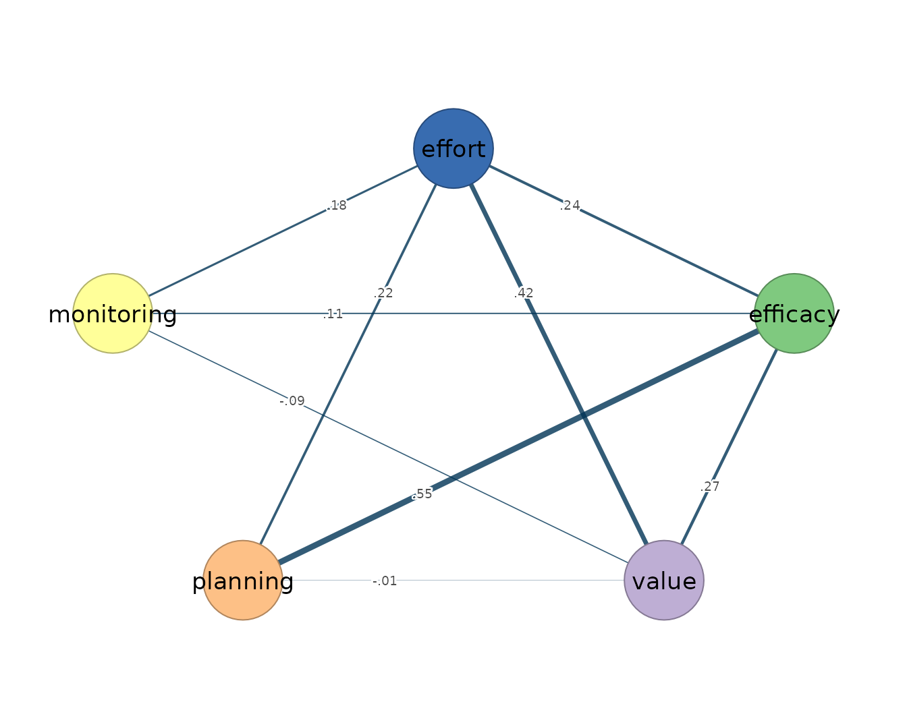

# 5. Multilevel VAR

The multilevel vector autoregression models the intensive longitudinal
series of an entire panel jointly, decomposing each person’s
observations into a stable person-specific mean and momentary deviations
around that mean, and fitting a first-order dynamic process to the
deviations ([Epskamp et al. 2018](#ref-epskamp2018mlvar)). Its estimand
differs from that of the single-subject estimators in this package:
where
[`fit_var()`](https://mohsaqr.github.io/idiographic/reference/fit_var.md)
and
[`fit_graphical_var()`](https://mohsaqr.github.io/idiographic/reference/fit_graphical_var.md)
recover one individual’s dynamics,
[`fit_mlvar()`](https://mohsaqr.github.io/idiographic/reference/fit_mlvar.md)
pools across individuals and recovers the average within-person process
— the lag-one structure a typical member of the panel follows — together
with a separate description of how the stable person-level means covary.
It presumes weak stationarity of each person’s series, meaning that the
mean, variance, and autocovariance are constant across the observation
window; linear, lag-one dynamics; approximately Gaussian residuals;
equally spaced measurement occasions; and a correctly specified
multilevel structure for the pooling.

The model yields three networks over the same variables, and the
distinction between the within-person and between-person layers is
central to reading them. The temporal network is directed and
within-person: an edge `from -> to` is the fixed effect of `from` at
occasion $`t-1`$ on `to` at occasion $`t`$, holding the other lagged
variables constant — the average lag-one prediction across the panel,
expressed on within-person deviations. The contemporaneous network is
undirected and also within-person: after the previous occasion has
explained what it can, the residuals within the same occasion may still
be associated, and the contemporaneous edges are the average
within-person partial correlations among these same-occasion residuals.
The between-person network is a different estimand altogether. Its edges
are partial correlations among the stable person-level means —
associations among who scores high on average, not among what fluctuates
within anyone — and it must not be interpreted as a within-person
process ([Epskamp et al. 2018](#ref-epskamp2018mlvar)). The two levels
answer different questions, are estimated from different sources of
variance, and are under no obligation to agree: a pair of variables can
be positively coupled within persons and negatively associated between
them, or the reverse, and the fit below contains exactly such a sign
reversal.

The multilevel model therefore targets the group-average within-person
structure, not any single person’s network. On the idiographic premise
that within-person dynamics need not match the structure of the group,
the average process is a summary of the panel, not a portrait of any
member: a fixed-effect temporal network can be weak or null while
individual students carry strong, mutually cancelling dynamics.
[`fit_mlvar()`](https://mohsaqr.github.io/idiographic/reference/fit_mlvar.md)
accordingly complements rather than replaces the single-subject
estimators — it is the appropriate tool when the question concerns the
typical process and the panel is large, and the subject-by-subject fits
remain the appropriate tool when individual differences in dynamics are
themselves the target.

## Data and preprocessing

The estimator expects long format: one row per person-occasion, an id
column, and numeric time-varying indicators ordered within person. The
bundled `srl` data hold self-regulated-learning indicators for 36
students measured over 156 occasions each; the multilevel model uses the
full panel on five indicators: `efficacy`, `value`, `planning`,
`monitoring`, and `effort`. Because the estimators absorb assumption
violations silently — a trending series inflates its autoregressive
coefficient rather than producing an error — the stationarity screen
precedes the fit, with `min_obs = 100` requiring at least one hundred
usable occasions per student.

``` r

vars <- c("efficacy", "value", "planning", "monitoring", "effort")
preprocess(srl, vars = vars, id = "name", min_obs = 100)
#> Idiographic Preprocessing
#>   Variables:      5 (efficacy, value, planning, monitoring, effort)
#>   Ordered rows:   5616
#>   Retained pairs: 5548
#>   Trend flags:    10
#>   High AR flags:  0
#>   Drift flags:    1
#>   Unit-root risk: 0
#>   Zero variance:  0
#>   Tables:         x$pairs | x$counts | x$diagnostics
#> 
#> 10 of 180 subject-series show a trend or unit-root that can bias the temporal network. preprocess() only diagnosed this; to clean just the series that need it, re-run with:
#>   preprocess(data = srl, vars = vars, id = "name", min_obs = 100, detrend = "auto")
```

The 36 students contribute 5616 ordered rows, of which 5548 survive as
complete current/lagged pairs: each student loses the first occasion to
the initial lag, and a few lose more to missing values. Ten
subject-series trip the linear-trend flag and one shows drift between
the halves of its window — a stationarity caution to carry into
interpretation — but no series shows zero variance, near-unit-root
persistence, or a unit root, so the model is fitted on the series as
they stand.

## Fitting the model

The call specifies the mixed-model backend (`estimator = "lmer"`), a
common temporal matrix across students (`temporal = "fixed"`), a common
residual partial-correlation layer (`contemporaneous = "fixed"`), and
the full set of lagged predictors rather than autoregressions only
(`AR = FALSE`). The fixed-effect specification is deliberately
conservative: it estimates the average temporal network without random
slopes, which keeps the model fast and estimable at the cost of any
statement about how individual students deviate from the average.

``` r

mlvar_fit <- fit_mlvar(
  srl, vars = vars, id = "name",
  estimator = "lmer", temporal = "fixed", contemporaneous = "fixed",
  AR = FALSE
)
mlvar_fit
#> mlVAR result: 36 subjects, 5548 observations, 5 variables (lags 1)
#>   Temporal edges significant at p<0.05: 2 / 25
#> 
#>   Temporal [directed]
#>     weights [-0.049, 0.044]  |  +17 / -8 edges
#>                efficacy value planning monitoring effort
#>     efficacy      -0.05  0.01     0.01      -0.01   0.00
#>     value          0.00  0.04     0.01      -0.01   0.03
#>     planning       0.00 -0.01     0.00       0.02  -0.02
#>     monitoring     0.02  0.01     0.01       0.01   0.03
#>     effort         0.01 -0.02     0.00       0.00   0.01
#> 
#>   Contemporaneous [undirected]
#>     weights [0.026, 0.274]  |  +10 / -0 edges
#>                efficacy value planning monitoring effort
#>     efficacy       0.00  0.21     0.24       0.16   0.21
#>     value          0.21  0.00     0.19       0.07   0.13
#>     planning       0.24  0.19     0.00       0.03   0.27
#>     monitoring     0.16  0.07     0.03       0.00   0.14
#>     effort         0.21  0.13     0.27       0.14   0.00
#> 
#>   Between [undirected]
#>     weights [-0.086, 0.553]  |  +8 / -2 edges
#>                efficacy value planning monitoring effort
#>     efficacy       0.00  0.27     0.55       0.11   0.24
#>     value          0.27  0.00    -0.01      -0.09   0.42
#>     planning       0.55 -0.01     0.00       0.00   0.22
#>     monitoring     0.11 -0.09     0.00       0.00   0.18
#>     effort         0.24  0.42     0.22       0.18   0.00
#> 
#>   plot(x) | plot(x, layer = "temporal") | plot(x, layer = "between") 
#>   edges(x) | nodes(x) | summary(x) | coefs(x) | matrices(x)
```

The fitted object pools 36 subjects and 5548 observations on five
variables into the three layers. The temporal layer is weak: only 2 of
the 25 fixed lag-one effects (self-loops included) reach significance at
$`p < .05`$, and the weights, self-loops included, span -0.049 to 0.044.
The contemporaneous layer is dense and entirely positive, with
within-occasion partial correlations reaching 0.274. The between-person
layer is the strongest of the three, spanning -0.086 to 0.553 with eight
positive and two negative edges.

## Reading the output

The [`summary()`](https://rdrr.io/r/base/summary.html) method reports
one row per network layer, with the edge count, density, and mean
absolute weight.

``` r

summary(mlvar_fit)
#>           network n_nodes n_edges density mean_abs_weight n_positive n_negative
#> 1        temporal       5      20       1      0.01212956         14          6
#> 2 contemporaneous       5      10       1      0.16471314         10          0
#> 3         between       5      10       1      0.20864447          8          2
```

No layer is pruned — the model is unregularized, so every off-diagonal
cell carries an estimate and each density is 1 — which makes the mean
absolute weight the informative column. The temporal mean of 0.012 is an
order of magnitude below the contemporaneous 0.165 and the
between-person 0.209: on average, a student’s state one occasion earlier
predicts little, while variables co-move within occasions and, above
all, stable student averages covary. The
[`edges()`](https://mohsaqr.github.io/idiographic/reference/edges.md)
accessor lists the edges of a layer in decreasing magnitude.

``` r

edges(mlvar_fit, network = "temporal", n = 5)
#>    network       from         to      weight
#> 1 temporal monitoring     effort  0.02913069
#> 2 temporal      value     effort  0.02907386
#> 3 temporal monitoring   efficacy  0.02438515
#> 4 temporal     effort      value -0.02186814
#> 5 temporal   planning monitoring  0.01660044
```

The strongest average lag-one effects between distinct variables run
from monitoring at $`t-1`$ to effort at $`t`$ (0.029), from value to
effort (0.029), and from monitoring to efficacy (0.024); the strongest
negative effect runs from effort to value (-0.022). Each is an average
within-person effect — a claim about the typical student’s
occasion-to-occasion prediction, not a claim that holds for every
student.

``` r

edges(mlvar_fit, network = "contemporaneous", n = 5)
#>           network     from       to    weight
#> 1 contemporaneous planning   effort 0.2739070
#> 2 contemporaneous efficacy planning 0.2408473
#> 3 contemporaneous efficacy   effort 0.2082937
#> 4 contemporaneous efficacy    value 0.2067757
#> 5 contemporaneous    value planning 0.1915841
```

The contemporaneous layer is led by planning–effort (0.274),
efficacy–planning (0.241), and efficacy–effort (0.208). Each is an
average within-person, within-occasion conditional association: on
occasions when a student reports more planning than their own average,
they also report more effort at the same occasion, over and above what
the other indicators and the previous occasion explain.

``` r

edges(mlvar_fit, network = "between", n = 5)
#>   network     from       to    weight
#> 1 between efficacy planning 0.5530795
#> 2 between    value   effort 0.4152406
#> 3 between efficacy    value 0.2742516
#> 4 between efficacy   effort 0.2395848
#> 5 between planning   effort 0.2198713
```

The between-person layer reads differently in kind, not merely in
strength. Its strongest edge, efficacy–planning at 0.553, states that
students whose average efficacy is high also report high average
planning; value–effort at 0.415 is likewise a statement about stable
differences among students. Nothing in these edges concerns change
within any student. The value–monitoring pair makes the contrast between
the two levels concrete: the association is positive within persons
(0.07 in the contemporaneous layer) and negative between persons (-0.09
in the between layer) — a student momentarily above their own value
average tends also to be above their monitoring average, while students
whose value is high on average tend to have lower average monitoring
than their peers.

Node-level structure follows from the edges through
[`nodes()`](https://mohsaqr.github.io/idiographic/reference/nodes.md),
whose strength column sums the absolute weights incident to each node
within a layer.

``` r

nodes(mlvar_fit)
#>            network       node   strength out_strength in_strength         self
#> 1         temporal   efficacy 0.06867091   0.03466279  0.03400812 -0.048519405
#> 2         temporal      value 0.10716085   0.05222493  0.05493593  0.044116371
#> 3         temporal   planning 0.08073748   0.04107373  0.03966374 -0.001996653
#> 4         temporal monitoring 0.11638052   0.07786856  0.03851196  0.006469844
#> 5         temporal     effort 0.11223257   0.03676115  0.07547142  0.008863988
#> 6  contemporaneous   efficacy 0.81351544           NA          NA  0.000000000
#> 7  contemporaneous      value 0.59816798           NA          NA  0.000000000
#> 8  contemporaneous   planning 0.73197078           NA          NA  0.000000000
#> 9  contemporaneous monitoring 0.39957216           NA          NA  0.000000000
#> 10 contemporaneous     effort 0.75103653           NA          NA  0.000000000
#> 11         between   efficacy 1.17596067           NA          NA  0.000000000
#> 12         between      value 0.78239697           NA          NA  0.000000000
#> 13         between   planning 0.78273021           NA          NA  0.000000000
#> 14         between monitoring 0.37734989           NA          NA  0.000000000
#> 15         between     effort 1.05445168           NA          NA  0.000000000
```

In the temporal layer monitoring has the largest out-strength (0.078)
and effort the largest in-strength (0.075), so the average lagged
signal, weak as it is, flows from monitoring toward effort; the largest
single temporal coefficients are the self-loops of efficacy (-0.049) and
value (0.044), reported in the `self` column. In the between-person
layer efficacy has the largest strength (1.176), driven by its
associations with planning and value, followed by effort (1.054). The
full coefficient tables are available from `coefs(mlvar_fit)`, and the
three layer matrices from
[`matrices()`](https://mohsaqr.github.io/idiographic/reference/matrices.md).

``` r

matrices(mlvar_fit)
#> 
#> $temporal
#>            efficacy  value planning monitoring effort
#> efficacy     -0.049  0.002    0.002      0.024  0.006
#> value         0.011  0.044   -0.007      0.015 -0.022
#> planning      0.014  0.012   -0.002      0.010  0.005
#> monitoring   -0.008 -0.010    0.017      0.006 -0.004
#> effort        0.001  0.029   -0.016      0.029  0.009
#> 
#> $contemporaneous
#>            efficacy value planning monitoring effort
#> efficacy      0.000 0.207    0.241      0.158  0.208
#> value         0.207 0.000    0.192      0.074  0.126
#> planning      0.241 0.192    0.000      0.026  0.274
#> monitoring    0.158 0.074    0.026      0.000  0.143
#> effort        0.208 0.126    0.274      0.143  0.000
#> 
#> $between
#>            efficacy  value planning monitoring effort
#> efficacy      0.000  0.274    0.553      0.109  0.240
#> value         0.274  0.000   -0.007     -0.086  0.415
#> planning      0.553 -0.007    0.000      0.003  0.220
#> monitoring    0.109 -0.086    0.003      0.000  0.180
#> effort        0.240  0.415    0.220      0.180  0.000
```

The matrices restate the layer contrast cell by cell: the
contemporaneous matrix is entirely positive with planning–effort (0.274)
as its largest entry, while the between-person efficacy–planning cell
(0.553) exceeds every within-person association in the model — a
reminder that the two layers estimate different quantities and require
separate interpretation.

## Visualizing the network

Plotting the fit draws the three layers side by side: arrows in the
temporal panel denote average lag-one prediction, edge width scales with
absolute weight, and colour encodes sign.

``` r

plot(mlvar_fit)
```



The contrast between panels restates the summary graphically: thin,
diffuse temporal arrows against dense undirected contemporaneous and
between-person structure. Each layer can also be drawn alone.

``` r

plot(mlvar_fit, layer = "temporal")
```



The temporal layer is thin throughout; monitoring and value are the
clearest lagged predictors of later effort.

``` r

plot(mlvar_fit, layer = "contemporaneous")
```



The contemporaneous layer shows uniformly positive within-occasion
partial correlations, led by planning–effort and efficacy–planning.

The two within-person layers combine into a mixed network — directed
average lag-one effects and undirected average contemporaneous partial
correlations — which `plot(mlvar_fit, mixed = TRUE)` draws in one graph,
the temporal edges as curved arrows and the contemporaneous edges as
straight lines.

``` r

plot(mlvar_fit, mixed = TRUE)
```



``` r

plot(mlvar_fit, layer = "between")
```



The between-person layer is dominated by efficacy–planning and
value–effort. It describes stable differences among students, not
within-student change, and no edge in it is a temporal mechanism. A
parallel caution applies to the fixed-effect layers themselves: as
averages they can mask heterogeneous individual dynamics, and where
those individual differences are the question, the single-subject
estimators of the preceding vignettes are the instrument.

## References

Epskamp, Sacha, Lourens J. Waldorp, René Mõttus, and Denny Borsboom.
2018. “The Gaussian Graphical Model in Cross-Sectional and Time-Series
Data.” *Multivariate Behavioral Research* 53 (4): 453–80.
