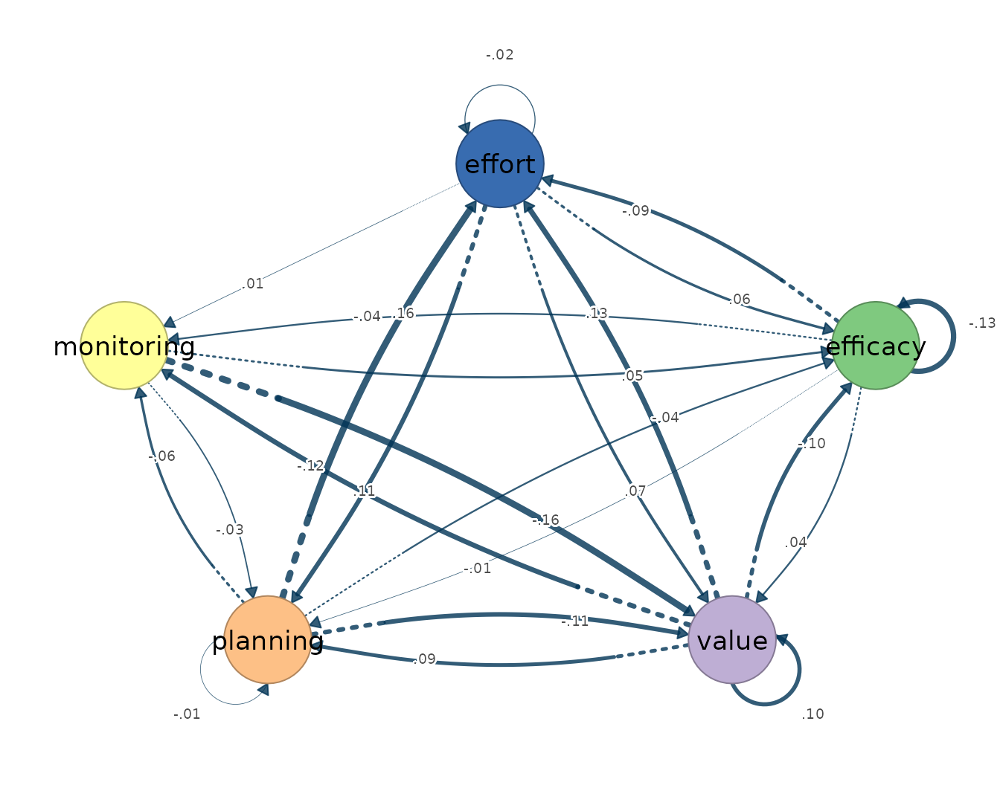
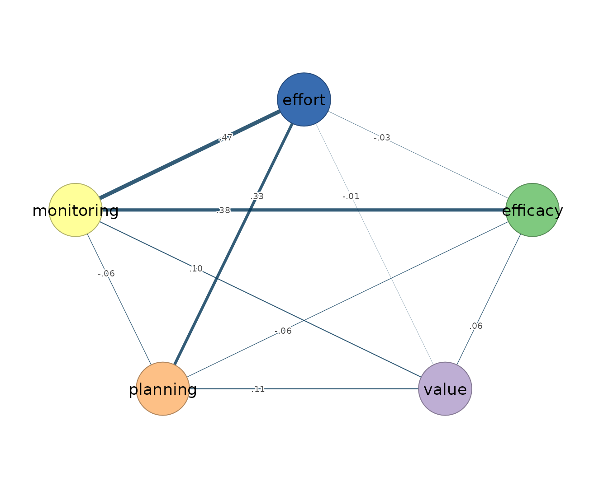
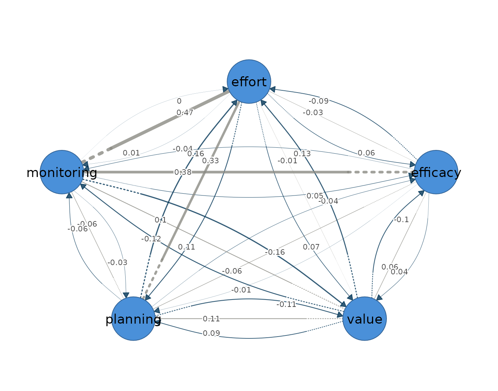

# 3. Ordinary VAR

``` r

library(idiographic)
data(srl)
vars <- c("efficacy", "value", "planning", "monitoring", "effort")
has_cograph <- requireNamespace("cograph", quietly = TRUE)
```

The first-order vector autoregression, VAR(1), is the reference model
for person-specific network estimation from intensive longitudinal data.
It models one person’s multivariate series as a first-order Gaussian
process, in which each occasion’s measurements depend jointly on the
values of all variables one occasion earlier and on the associations
that remain among the variables within the same occasion. It is an
idiographic model, estimated for a single individual, on the premise
that within-person dynamics need not match the between-person structure
of the group. It presumes weak stationarity, meaning that the mean,
variance, and autocovariance of every series are constant across the
observation window; linear, lag-one dynamics; approximately Gaussian
fluctuations; and equally spaced measurement occasions.

The model yields two networks over the same variables ([Epskamp et al.
2018](#ref-epskamp2018mlvar)). The temporal network is directed
within-person lag-one prediction: an edge `from -> to` states that the
value of `from` at occasion $`t-1`$ predicts the value of `to` at
occasion $`t`$ within the same person, holding the other lagged
variables constant, which is predictability in the Granger sense
([Bringmann et al. 2013](#ref-bringmann2013)). The self-loop of each
variable is its autoregression — the inertia, or carry-over, of that
variable from one occasion to the next. The contemporaneous network is
undirected within-occasion partial correlation: after the previous
occasion has explained what it can, the part of each variable left
unexplained — its innovation — may still be associated with the
innovations of the others, and the contemporaneous edges are the partial
correlations among these remainders, the within-occasion associations
that lagged prediction does not account for.

[`fit_var()`](https://mohsaqr.github.io/idiographic/reference/fit_var.md)
estimates both networks by ordinary least squares, one regression per
variable, without regularization. Each equation carries one coefficient
per lagged predictor plus an intercept, so the size of the temporal
network grows quadratically in the number of variables and the sampling
variance of the estimates grows with it. The estimates are unbiased,
every cell of both networks receives a coefficient, and no edge is
removed on the estimator’s behalf, which leaves the analyst to judge
which small values are noise. This makes ordinary VAR the unbiased
idiographic baseline: the appropriate estimator when the number of
occasions is large relative to the number of parameters and every
estimate is wanted for inspection, and the reference against which the
regularized
[`fit_graphical_var()`](https://mohsaqr.github.io/idiographic/reference/fit_graphical_var.md)
trades variance for sparsity by shrinking weak edges to exactly zero
under an extended-BIC penalty. For several people,
[`fit_var_each()`](https://mohsaqr.github.io/idiographic/reference/fit_var_each.md)
fits a separate ordinary VAR per person and
[`fit_mlvar()`](https://mohsaqr.github.io/idiographic/reference/fit_mlvar.md)
pools information across people through random effects.

## Data and preprocessing

The estimator expects long format: one row per person-occasion, an id
column, and numeric time-varying indicators ordered within person. The
bundled `srl` data hold self-regulated-learning indicators for 36
students measured over 156 occasions each; this vignette fits a single
student, Grace, on five indicators: `efficacy`, `value`, `planning`,
`monitoring`, and `effort`.
[`fit_var()`](https://mohsaqr.github.io/idiographic/reference/fit_var.md)
standardizes each variable to unit variance (`scale = TRUE`), so that
coefficients are comparable across indicators, and centres within person
(`center_within = TRUE`), so that the intercept absorbs the person mean;
it does not remove trends. Because a violated assumption is absorbed
silently — a trend, for instance, inflates the autoregressive diagonal
rather than producing an error — the stationarity screen precedes the
fit.

``` r

preprocess(srl, vars = vars, id = "name")
#> Idiographic Preprocessing
#>   Variables:      5 (efficacy, value, planning, monitoring, effort)
#>   Ordered rows:   5616
#>   Retained pairs: 5548
#>   Trend flags:    10
#>   High AR flags:  0
#>   Drift flags:    1
#>   Unit-root risk: 0
#>   Zero variance:  0
#>   Tables:         x$pairs | x$counts | x$diagnostics
#> 
#> 10 of 180 subject-series show a trend or unit-root that can bias the temporal network. preprocess() only diagnosed this; to clean just the series that need it, re-run with:
#>   preprocess(data = srl, vars = vars, id = "name", detrend = "auto")
```

Across all 36 students the five indicators give 5616 ordered rows, of
which 5548 survive as complete current/lagged pairs. Ten subject-series
trip the linear-trend flag and one a drift flag, while the
high-autoregression, unit-root, and zero-variance screens are clear.
Grace’s own five series are among the clean ones: her 156 ordered
occasions yield 155 complete pairs and trip no flag, so the model is
fitted on her series as they stand. Where a flagged series is to be
modelled, the `detrend` argument of
[`preprocess()`](https://mohsaqr.github.io/idiographic/reference/preprocess.md)
removes the offending trend before fitting, as the preprocessing
vignette describes; a persistent trend left in place can masquerade as
lag-one structure.

## Fitting the model

The estimator takes the data, the variable set, the id column, and the
subject. The `subject =` argument selects the person inside the call, so
the occasion ordering that the lag-one design requires is preserved
rather than reconstructed by the caller.

``` r

var_fit <- fit_var(srl, vars = vars, id = "name", subject = "Grace",
                   scale = TRUE)
var_fit
#> OLS VAR Result
#>   Variables:      5 (efficacy, value, planning, monitoring, effort)
#>   Observations:   155
#>   Temporal edges: 25 / 25
#>   Contemp edges:  10 / 10
#> 
#>   Temporal [directed]
#>     weights [-0.160, 0.159]  |  +11 / -14 edges
#>                efficacy value planning monitoring effort
#>     efficacy      -0.13  0.04    -0.01      -0.04  -0.09
#>     value         -0.10  0.10     0.09      -0.12   0.13
#>     planning      -0.04 -0.11    -0.01      -0.06   0.16
#>     monitoring     0.05 -0.16    -0.03       0.00   0.00
#>     effort         0.06  0.07     0.11       0.01  -0.02
#> 
#>   Contemporaneous [undirected]
#>     weights [-0.060, 0.467]  |  +6 / -4 edges
#>                efficacy value planning monitoring effort
#>     efficacy       0.00  0.06    -0.06       0.38  -0.03
#>     value          0.06  0.00     0.11       0.10  -0.01
#>     planning      -0.06  0.11     0.00      -0.06   0.33
#>     monitoring     0.38  0.10    -0.06       0.00   0.47
#>     effort        -0.03 -0.01     0.33       0.47   0.00
#> 
#>   plot(x) | plot(x, layer = "temporal") 
#>   edges(x) | nodes(x) | summary(x) | coefs(x) | matrices(x)
```

The call returns a `var_result` object whose print method reports both
estimated networks with their weight ranges and signed-edge counts.
Grace contributes 155 usable occasions, the single lost row being the
first occasion, which has no predecessor. All 25 temporal coefficients
and all 10 contemporaneous partial correlations are estimated — least
squares retains every edge — with the temporal weights confined between
−0.160 and 0.159 while the strongest contemporaneous weight reaches
0.467, a first indication that Grace’s within-occasion co-regulation is
stronger than her lag-one carry-over.

## Reading the output

The [`summary()`](https://rdrr.io/r/base/summary.html) method reports
one row per network layer, with the edge count, density, mean absolute
weight, and the split of positive and negative edges.

``` r

summary(var_fit)
#>           network n_nodes n_edges density mean_abs_weight n_positive n_negative
#> 1        temporal       5      20       1      0.07457677          9         11
#> 2 contemporaneous       5      10       1      0.16039547          6          4
```

Both layers are fully dense, as they must be under least squares, so the
comparison is carried by the weights: the contemporaneous mean absolute
weight of 0.160 is roughly twice the temporal 0.075. Within-occasion
association dominates lagged prediction in Grace’s process, a pattern
typical of self-report affect and motivation series measured a few times
per day.

The
[`edges()`](https://mohsaqr.github.io/idiographic/reference/edges.md)
accessor returns one row per edge in decreasing magnitude; `network =`
selects a layer and `n =` keeps the strongest edges. For the temporal
layer the `from` and `to` columns read as `from` at occasion $`t-1`$
predicting `to` at occasion $`t`$.

``` r

edges(var_fit, network = "temporal", n = 5)
#>    network       from         to     weight
#> 1 temporal monitoring      value -0.1604470
#> 2 temporal   planning     effort  0.1591502
#> 3 temporal      value     effort  0.1346800
#> 4 temporal      value monitoring -0.1204242
#> 5 temporal   planning      value -0.1098008
```

Grace’s strongest lag-one effects are small. Monitoring on one occasion
predicts lower task value on the next (−0.160), and planning predicts
higher subsequent effort regulation (0.159): deliberate planning carries
over into effort, while heavy monitoring is followed by a dip in
reported task value. At this magnitude, and with 155 occasions, the
individual temporal coefficients are estimated imprecisely — least
squares is unbiased but high-variance — so the temporal layer is better
read as a pattern than as a set of point claims. Where a sparse,
multiplicity-controlled temporal network is required,
[`fit_graphical_var()`](https://mohsaqr.github.io/idiographic/reference/fit_graphical_var.md)
is the estimator of choice.

``` r

edges(var_fit, network = "contemporaneous", n = 5)
#>           network       from         to     weight
#> 1 contemporaneous monitoring     effort 0.46674337
#> 2 contemporaneous   efficacy monitoring 0.37844327
#> 3 contemporaneous   planning     effort 0.33179869
#> 4 contemporaneous      value   planning 0.10632926
#> 5 contemporaneous      value monitoring 0.09825036
```

The contemporaneous layer is where Grace’s process is organized.
Monitoring and effort share a partial correlation of 0.467, and
monitoring also couples with efficacy (0.378) and planning with effort
(0.332). Within a single occasion, monitoring, effort, and efficacy move
together after the other indicators are partialled out; these are the
same three edges that survive the penalized selection in the
graphical-VAR vignette, there with downwardly biased weights.

Node-level structure follows from
[`nodes()`](https://mohsaqr.github.io/idiographic/reference/nodes.md),
whose strength column sums the absolute weights incident to each node
within a layer, split into out- and in-strength for the directed
temporal network, with the self-loop reported separately.

``` r

nodes(var_fit)
#>            network       node  strength out_strength in_strength         self
#> 1         temporal   efficacy 0.4379985    0.1821870   0.2558116 -0.130248472
#> 2         temporal      value 0.8318268    0.4468467   0.3849801  0.103987599
#> 3         temporal   planning 0.6027558    0.3639382   0.2388176 -0.006545312
#> 4         temporal monitoring 0.4756466    0.2470050   0.2286416  0.004077164
#> 5         temporal     effort 0.6348432    0.2515586   0.3832846 -0.024338368
#> 6  contemporaneous   efficacy 0.5314378           NA          NA  0.000000000
#> 7  contemporaneous      value 0.2755102           NA          NA  0.000000000
#> 8  contemporaneous   planning 0.5548748           NA          NA  0.000000000
#> 9  contemporaneous monitoring 1.0030222           NA          NA  0.000000000
#> 10 contemporaneous     effort 0.8430642           NA          NA  0.000000000
```

In the temporal layer `value` has the highest strength (0.832), driven
by both outgoing and incoming effects; in the contemporaneous layer
`monitoring` is the hub (1.003), consistent with its position at the
junction of the two strongest within-occasion edges. The autoregressions
are weak throughout — the largest, for efficacy, is −0.13 — so Grace’s
states carry little inertia from one occasion to the next. The full
coefficient tables, including intercepts and self-loops, are available
from `coefs(var_fit)`, and the underlying matrices — the lagged
coefficient matrix, the residual covariance, and the partial-correlation
matrix derived from it — from `matrices(var_fit)`.

## Visualizing the network

Plotting the fit draws both layers side by side: arrows in the temporal
panel denote lag-one prediction, edge width scales with absolute weight,
and colour encodes sign.

``` r

plot(var_fit)
```


``` r

plot(var_fit, layer = "temporal")
```



The temporal graph is diffuse, matching the narrow weight range: no
single lagged driver dominates Grace’s next-occasion state.

``` r

plot(var_fit, layer = "contemporaneous")
```



The contemporaneous graph is concentrated: the thick monitoring–effort
edge and its links to efficacy and planning form the within-occasion
co-regulation core that the summary statistics quantified. Because the
estimates are person-specific, both graphs describe Grace’s process and
carry no claim about other students.

The two layers together make a mixed network — directed lag-one effects
and undirected contemporaneous partial correlations — and
`plot(var_fit, mixed = TRUE)` draws them in one graph, the temporal
edges as curved arrows and the contemporaneous edges as straight lines.

``` r

plot(var_fit, mixed = TRUE)
```



## References

Bringmann, Laura F., Nathalie Vissers, Marieke Wichers, et al. 2013. “A
Network Approach to Psychopathology: New Insights into Clinical
Longitudinal Data.” *PLoS ONE* 8 (4): e60188.

Epskamp, Sacha, Lourens J. Waldorp, René Mõttus, and Denny Borsboom.
2018. “The Gaussian Graphical Model in Cross-Sectional and Time-Series
Data.” *Multivariate Behavioral Research* 53 (4): 453–80.
