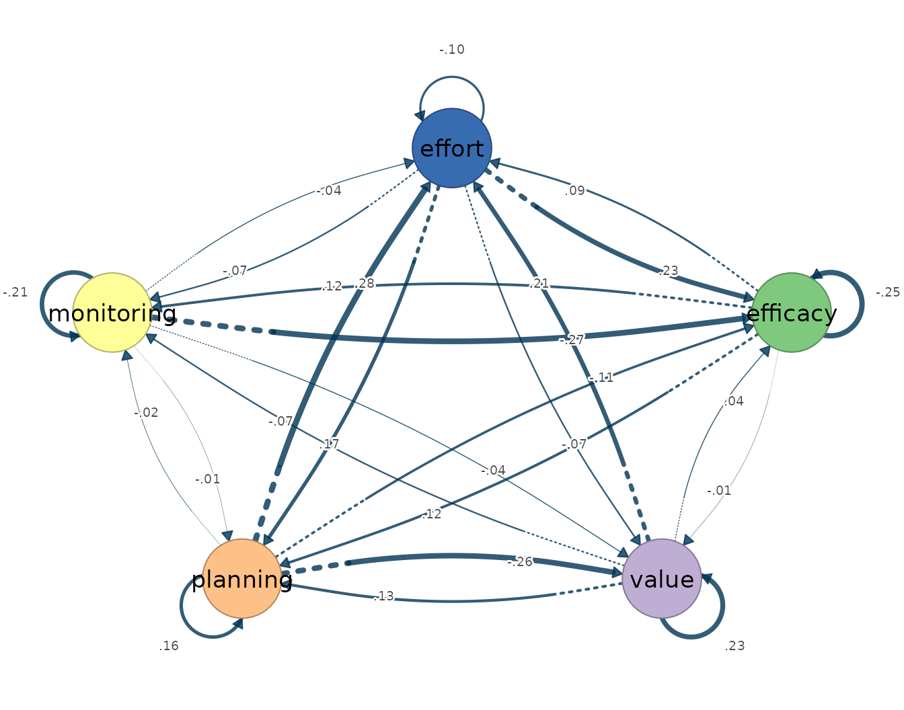

# 8. Rolling networks

``` r

library(idiographic)
data(srl)
vars <- c("efficacy", "value", "planning", "monitoring", "effort")
has_cograph <- requireNamespace("cograph", quietly = TRUE)
```

Rolling windows ask whether a person’s dynamics are **stable over
time**. Each window refits the estimator on a moving slice of the
series.

## Rolling OLS VAR

Set `keep_fits = TRUE` to retain the per-window model objects for
inspection and plotting.

``` r

rolling_ols <- rolling_var(srl, vars = vars, id = "name", subject = "Grace",
                           window_size = 50, step = 20, scale = TRUE,
                           keep_fits = TRUE)

rolling_ols
#> Rolling VAR Result
#>   Subjects:   1
#>   Windows:    6
#>   Variables:  5 (efficacy, value, planning, monitoring, effort)
#>   Tables:     x$estimates | x$windows | x$failures
#>   Cograph:    cograph::splot(x$fits[[1]])
#>   Matrices:   matrices(x$fits[[1]])
```

The result is a tidy table by default — one row per window-by-edge
estimate. Use [`head()`](https://rdrr.io/r/utils/head.html) to peek;
never index the table with brackets.

``` r

head(as.data.frame(rolling_ols))
#>   subject window start_row end_row start_day end_day start_beep end_beep
#> 1   Grace      1         1      50      <NA>    <NA>         NA       NA
#> 2   Grace      1         1      50      <NA>    <NA>         NA       NA
#> 3   Grace      1         1      50      <NA>    <NA>         NA       NA
#> 4   Grace      1         1      50      <NA>    <NA>         NA       NA
#> 5   Grace      1         1      50      <NA>    <NA>         NA       NA
#> 6   Grace      1         1      50      <NA>    <NA>         NA       NA
#>    network       from       to     weight
#> 1 temporal   efficacy efficacy -0.2542949
#> 2 temporal      value efficacy  0.0364689
#> 3 temporal   planning efficacy -0.1061240
#> 4 temporal monitoring efficacy -0.2716587
#> 5 temporal     effort efficacy  0.2253335
#> 6 temporal   efficacy    value -0.0111859
```

Inspect a single window’s matrices or plot it by passing `fit` — by name
or by index — instead of digging into `$fits`.

``` r

matrices(rolling_ols, fit = 1)
#> 
#> $beta
#>              [,1]   [,2]   [,3]   [,4]   [,5]   [,6]
#> efficacy   -0.003 -0.254  0.036 -0.106 -0.272  0.225
#> value       0.030 -0.011  0.233 -0.265 -0.040 -0.071
#> planning   -0.020  0.116  0.133  0.159 -0.014  0.168
#> monitoring  0.005  0.123 -0.067 -0.024 -0.212 -0.074
#> effort      0.023  0.086  0.206  0.277 -0.036 -0.101
#> 
#> $temporal
#>            efficacy  value planning monitoring effort
#> efficacy     -0.254  0.036   -0.106     -0.272  0.225
#> value        -0.011  0.233   -0.265     -0.040 -0.071
#> planning      0.116  0.133    0.159     -0.014  0.168
#> monitoring    0.123 -0.067   -0.024     -0.212 -0.074
#> effort        0.086  0.206    0.277     -0.036 -0.101
#> 
#> $residual_cov
#>            efficacy value planning monitoring effort
#> efficacy      0.847 0.206   -0.015      0.469  0.243
#> value         0.206 0.858    0.020      0.061  0.021
#> planning     -0.015 0.020    0.899      0.019  0.209
#> monitoring    0.469 0.061    0.019      0.964  0.461
#> effort        0.243 0.021    0.209      0.461  0.867
#> 
#> $kappa
#>            efficacy  value planning monitoring effort
#> efficacy      1.724 -0.358    0.072     -0.781 -0.076
#> value        -0.358  1.246   -0.045      0.077  0.040
#> planning      0.072 -0.045    1.199      0.122 -0.373
#> monitoring   -0.781  0.077    0.122      1.771 -0.755
#> effort       -0.076  0.040   -0.373     -0.755  1.666
#> 
#> $PCC
#>            efficacy  value planning monitoring effort
#> efficacy      0.000  0.245   -0.050      0.447  0.045
#> value         0.245  0.000    0.037     -0.052 -0.028
#> planning     -0.050  0.037    0.000     -0.084  0.264
#> monitoring    0.447 -0.052   -0.084      0.000  0.440
#> effort        0.045 -0.028    0.264      0.440  0.000
#> 
#> $PDC
#>            efficacy  value planning monitoring effort
#> efficacy     -0.206 -0.009    0.093      0.095  0.070
#> value         0.035  0.220    0.124     -0.061  0.194
#> planning     -0.105 -0.253    0.151     -0.022  0.263
#> monitoring   -0.217 -0.033   -0.011     -0.160 -0.029
#> effort        0.186 -0.059    0.136     -0.058 -0.084
```

``` r

plot(rolling_ols, fit = 1, layer = "temporal")
```



## Rolling graphical VAR

[`rolling_graphical_var()`](https://mohsaqr.github.io/idiographic/reference/rolling_graphical_var.md)
does the same with sparse estimation.

``` r

rolling_gvar <- rolling_graphical_var(srl, vars = vars, id = "name",
                                      subject = "Grace", window_size = 70,
                                      step = 25, n_lambda = 8, gamma = 0,
                                      keep_fits = TRUE)

rolling_gvar
#> Rolling Graphical VAR Result
#>   Subjects:   1
#>   Windows:    4
#>   Variables:  5 (efficacy, value, planning, monitoring, effort)
#>   Tables:     x$estimates | x$windows | x$failures
#>   Cograph:    cograph::splot(x$fits[[1]])
#>   Matrices:   matrices(x$fits[[1]])

head(as.data.frame(rolling_gvar))
#>   subject window start_row end_row start_day end_day start_beep end_beep
#> 1   Grace      1         1      70      <NA>    <NA>         NA       NA
#> 2   Grace      1         1      70      <NA>    <NA>         NA       NA
#> 3   Grace      1         1      70      <NA>    <NA>         NA       NA
#> 4   Grace      1         1      70      <NA>    <NA>         NA       NA
#> 5   Grace      1         1      70      <NA>    <NA>         NA       NA
#> 6   Grace      1         1      70      <NA>    <NA>         NA       NA
#>    network       from       to weight
#> 1 temporal   efficacy efficacy      0
#> 2 temporal      value efficacy      0
#> 3 temporal   planning efficacy      0
#> 4 temporal monitoring efficacy      0
#> 5 temporal     effort efficacy      0
#> 6 temporal   efficacy    value      0
```

``` r

plot(rolling_gvar, fit = 1, layer = "temporal")
```


