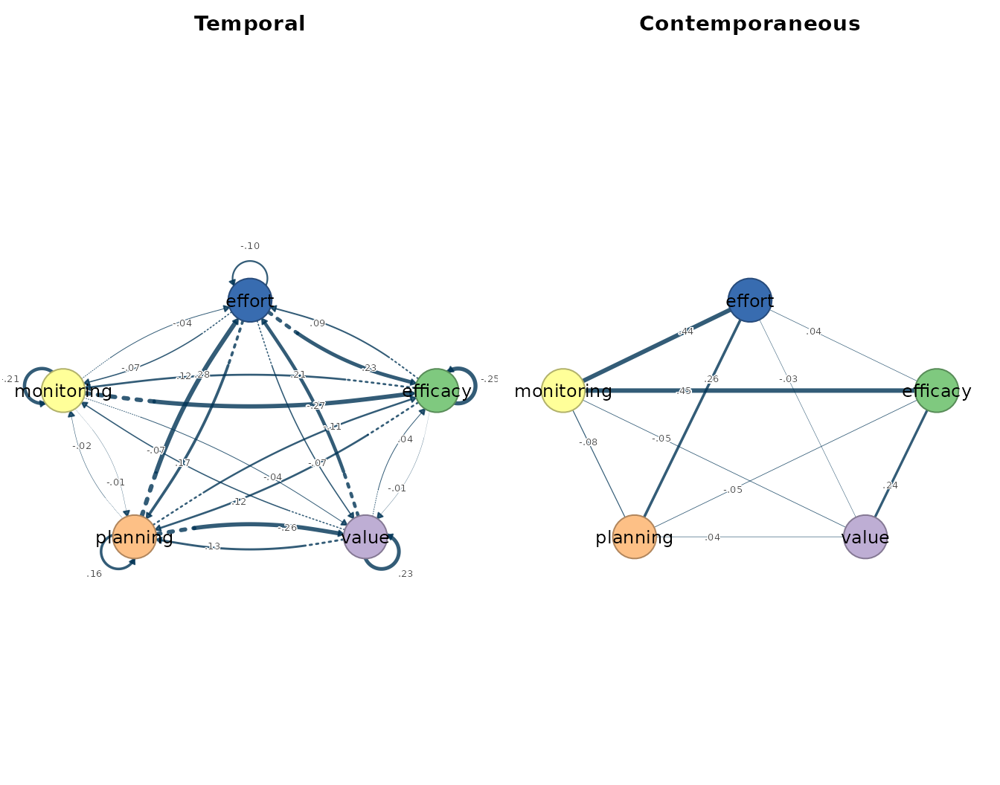
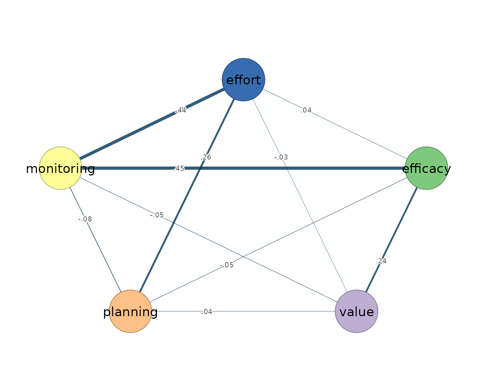

# 9. Rolling networks

Rolling networks relax the one assumption every full-series model in
this package shares: that a single within-person process holds across
the whole observation window. A vector autoregression fitted to all of
one person’s occasions returns one temporal and one contemporaneous
network and asserts, through its weak-stationarity assumption, that the
same dynamics generated the first week of the protocol and the last.
Rolling estimation withdraws that assertion. It slides a window of fixed
length along the ordered series of a single person and refits the
estimator inside each window, so stationarity is required only locally,
within a window, and the sequence of window fits describes how that
person’s own dynamics change over the protocol.

The estimand is correspondingly local and within-person. A temporal edge
`from -> to` in a given window states that this person’s deviation on
`from` at occasion $`t-1`$ predicts their deviation on `to` at occasion
$`t`$, for the occasions inside that window, holding the other lagged
variables constant. A contemporaneous edge is a window-local partial
correlation among the within-occasion innovations — the associations
that lag-one prediction inside the window does not account for
([Bringmann et al. 2013](#ref-bringmann2013); [Epskamp et al.
2018](#ref-epskamp2018mlvar)). Nothing in either estimand refers to
other people: every window is estimated from one individual’s occasions,
and differences between windows are within-person variation in estimated
dynamics, not differences between persons.

Two rolling estimators are provided.
[`fit_rolling_var()`](https://mohsaqr.github.io/idiographic/reference/fit_rolling_var.md)
refits the ordinary least-squares VAR in each window and is the
unregularized, time-varying baseline: every window returns a dense
temporal matrix and a dense contemporaneous matrix.
[`fit_rolling_graphical_var()`](https://mohsaqr.github.io/idiographic/reference/fit_rolling_graphical_var.md)
refits the penalized two-step estimator in each window — lasso-penalized
lagged regressions, a graphical lasso on their residuals, the penalty
selected per window by the extended Bayesian information criterion — so
each window carries its own sparsity decision. Both are descriptive
instruments: a sequence of window fits shows that local dynamics differ,
not why they differ. Rolling estimation is also not a remedy for short
series — each window contains fewer observations than the full series,
so the window size sets a bias-variance tradeoff in which smaller
windows track change more finely but estimate every network from less
data. Because adjacent windows share most of their occasions, their
estimates are strongly dependent, and window-size sensitivity should be
reported whenever rolling networks are offered as evidence of changing
dynamics.

## Data and preprocessing

The rolling estimators expect the same long format as their full-series
counterparts: one row per person-occasion, an id column, and numeric
time-varying indicators ordered within person. The bundled `srl` data
hold self-regulated-learning indicators for 36 students measured over
156 occasions each; this vignette fits a single student, Grace, on five
indicators. Passing `subject = "Grace"` selects her series inside the
call, so the full `srl` data remain intact. The stationarity screen
precedes the fit.

``` r

vars <- c("efficacy", "value", "planning", "monitoring", "effort")
preprocess(srl, vars = vars, id = "name", subject = "Grace")
#> Idiographic Preprocessing
#>   Variables:      5 (efficacy, value, planning, monitoring, effort)
#>   Ordered rows:   156
#>   Retained pairs: 155
#>   Trend flags:    0
#>   High AR flags:  0
#>   Drift flags:    0
#>   Unit-root risk: 0
#>   Zero variance:  0
#>   Tables:         x$pairs | x$counts | x$diagnostics
```

Grace’s 156 ordered occasions yield 155 complete current/lagged pairs,
and no series trips a trend, high-autoregression, drift, unit-root, or
zero-variance flag. A clean global screen does not settle the question
rolling estimation asks: the whole-series diagnostics average over the
protocol, and dynamics that shift midway can leave every global flag
silent. The window fits below pose that local question directly.

## Fitting the model

`window_size` sets the number of occasions in each local fit, `step`
sets how far the window advances, and `keep_fits = TRUE` stores each
fitted window model so that
[`matrices()`](https://mohsaqr.github.io/idiographic/reference/matrices.md)
and [`plot()`](https://rdrr.io/r/graphics/plot.default.html) can inspect
a selected window afterwards. With Grace’s 156 occasions, a 50-occasion
window advancing by 20 gives six windows, starting at occasions 1, 21,
41, 61, 81, and 101 and ending at occasion 150; each window’s networks
are estimated from the 49 lagged pairs its 50 occasions provide.

``` r

rolling_ols <- fit_rolling_var(
  srl, vars = vars, id = "name", subject = "Grace",
  window_size = 50, step = 20, scale = TRUE, keep_fits = TRUE
)
rolling_ols
#> Rolling VAR Result
#>   Subjects:   1
#>   Windows:    6
#>   Variables:  5 (efficacy, value, planning, monitoring, effort)
#>   Tables:     x$estimates | x$windows | x$failures
#>   Cograph:    cograph::splot(x$fits[[1]])
#>   Matrices:   matrices(x$fits[[1]])
```

The ordinary rolling fit returns six windows for Grace, each holding a
dense least-squares temporal matrix and a dense contemporaneous matrix —
the unregularized, time-varying baseline against which the sparse
variant can be read.

The graphical variant repeats the penalized estimation in every window.
Sparse selection contributes sampling variability of its own — the
selected edge set can change from window to window even when the
underlying process does not — so a larger window of 70 occasions
advancing by 25 is used to partially offset it, and a coarse penalty
grid (`n_lambda = 8`) with `gamma = 0`, the plain-BIC end of the
criterion, keeps the per-window selection inexpensive and less severe
toward retained edges than the default `gamma = 0.5`.

``` r

rolling_gvar <- fit_rolling_graphical_var(
  srl, vars = vars, id = "name", subject = "Grace",
  window_size = 70, step = 25, n_lambda = 8, gamma = 0,
  keep_fits = TRUE
)
rolling_gvar
#> Rolling Graphical VAR Result
#>   Subjects:   1
#>   Windows:    4
#>   Variables:  5 (efficacy, value, planning, monitoring, effort)
#>   Tables:     x$estimates | x$windows | x$failures
#>   Cograph:    cograph::splot(x$fits[[1]])
#>   Matrices:   matrices(x$fits[[1]])
```

The graphical rolling fit returns four windows, starting at occasions 1,
26, 51, and 76, each estimated from the 69 lagged pairs its 70 occasions
provide and each carrying its own EBIC-selected sparsity decision.

## Reading the output

[`as.data.frame()`](https://rdrr.io/r/base/as.data.frame.html) flattens
a rolling result to one row per window and edge, with the window’s start
and end rows carried alongside each weight; the first twelve rows cover
the temporal edges of Grace’s first window.

``` r

head(as.data.frame(rolling_ols), 12)
#>    subject window start_row end_row start_day end_day start_beep end_beep
#> 1    Grace      1         1      50      <NA>    <NA>         NA       NA
#> 2    Grace      1         1      50      <NA>    <NA>         NA       NA
#> 3    Grace      1         1      50      <NA>    <NA>         NA       NA
#> 4    Grace      1         1      50      <NA>    <NA>         NA       NA
#> 5    Grace      1         1      50      <NA>    <NA>         NA       NA
#> 6    Grace      1         1      50      <NA>    <NA>         NA       NA
#> 7    Grace      1         1      50      <NA>    <NA>         NA       NA
#> 8    Grace      1         1      50      <NA>    <NA>         NA       NA
#> 9    Grace      1         1      50      <NA>    <NA>         NA       NA
#> 10   Grace      1         1      50      <NA>    <NA>         NA       NA
#> 11   Grace      1         1      50      <NA>    <NA>         NA       NA
#> 12   Grace      1         1      50      <NA>    <NA>         NA       NA
#>     network       from       to      weight
#> 1  temporal   efficacy efficacy -0.25429487
#> 2  temporal      value efficacy  0.03646890
#> 3  temporal   planning efficacy -0.10612404
#> 4  temporal monitoring efficacy -0.27165868
#> 5  temporal     effort efficacy  0.22533350
#> 6  temporal   efficacy    value -0.01118590
#> 7  temporal      value    value  0.23299541
#> 8  temporal   planning    value -0.26487351
#> 9  temporal monitoring    value -0.04032158
#> 10 temporal     effort    value -0.07058221
#> 11 temporal   efficacy planning  0.11614890
#> 12 temporal      value planning  0.13268956
```

Within the first window, monitoring at occasion $`t-1`$ predicts lower
efficacy at $`t`$ (-0.272), planning predicts lower value (-0.265), and
planning predicts higher effort (0.277). These local coefficients exceed
anything the full-series least-squares fit reports for the same student
— its largest temporal coefficient is 0.160 in absolute value — which is
the rolling tradeoff stated numerically: a 50-occasion window can
express transient local dynamics that the full series averages away, and
it estimates them with correspondingly more noise.

``` r

matrices(rolling_ols, fit = 1)
#> 
#> $beta
#>            (Intercept) efficacy  value planning monitoring effort
#> efficacy        -0.003   -0.254  0.036   -0.106     -0.272  0.225
#> value            0.030   -0.011  0.233   -0.265     -0.040 -0.071
#> planning        -0.020    0.116  0.133    0.159     -0.014  0.168
#> monitoring       0.005    0.123 -0.067   -0.024     -0.212 -0.074
#> effort           0.023    0.086  0.206    0.277     -0.036 -0.101
#> 
#> $temporal
#>            efficacy  value planning monitoring effort
#> efficacy     -0.254  0.036   -0.106     -0.272  0.225
#> value        -0.011  0.233   -0.265     -0.040 -0.071
#> planning      0.116  0.133    0.159     -0.014  0.168
#> monitoring    0.123 -0.067   -0.024     -0.212 -0.074
#> effort        0.086  0.206    0.277     -0.036 -0.101
#> 
#> $residual_cov
#>            efficacy value planning monitoring effort
#> efficacy      0.847 0.206   -0.015      0.469  0.243
#> value         0.206 0.858    0.020      0.061  0.021
#> planning     -0.015 0.020    0.899      0.019  0.209
#> monitoring    0.469 0.061    0.019      0.964  0.461
#> effort        0.243 0.021    0.209      0.461  0.867
#> 
#> $kappa
#>            efficacy  value planning monitoring effort
#> efficacy      1.724 -0.358    0.072     -0.781 -0.076
#> value        -0.358  1.246   -0.045      0.077  0.040
#> planning      0.072 -0.045    1.199      0.122 -0.373
#> monitoring   -0.781  0.077    0.122      1.771 -0.755
#> effort       -0.076  0.040   -0.373     -0.755  1.666
#> 
#> $PCC
#>            efficacy  value planning monitoring effort
#> efficacy      0.000  0.245   -0.050      0.447  0.045
#> value         0.245  0.000    0.037     -0.052 -0.028
#> planning     -0.050  0.037    0.000     -0.084  0.264
#> monitoring    0.447 -0.052   -0.084      0.000  0.440
#> effort        0.045 -0.028    0.264      0.440  0.000
#> 
#> $PDC
#>            efficacy  value planning monitoring effort
#> efficacy     -0.206 -0.009    0.093      0.095  0.070
#> value         0.035  0.220    0.124     -0.061  0.194
#> planning     -0.105 -0.253    0.151     -0.022  0.263
#> monitoring   -0.217 -0.033   -0.011     -0.160 -0.029
#> effort        0.186 -0.059    0.136     -0.058 -0.084
```

[`matrices()`](https://mohsaqr.github.io/idiographic/reference/matrices.md)
with `fit = 1` returns the first window’s coefficient matrices: the
lag-one temporal matrix, the residual covariance and precision of the
innovations, and the partial correlations derived from them. The
window-one contemporaneous layer is dominated by efficacy–monitoring
(0.447) and monitoring–effort (0.440), close to Grace’s full-series
contemporaneous pattern: in this series the within-occasion structure is
more stable than the temporal coefficients.

``` r

edge_counts <- do.call(rbind, lapply(seq_along(rolling_gvar$fits), function(i) {
  data.frame(window = i, summary(rolling_gvar$fits[[i]]))
}))
edge_counts
#>   window         network n_nodes n_edges density mean_abs_weight n_positive
#> 1      1        temporal       5       0     0.0       0.0000000          0
#> 2      1 contemporaneous       5       3     0.3       0.1939779          3
#> 3      2        temporal       5       0     0.0       0.0000000          0
#> 4      2 contemporaneous       5       2     0.2       0.1114952          2
#> 5      3        temporal       5       0     0.0       0.0000000          0
#> 6      3 contemporaneous       5       3     0.3       0.1774513          3
#> 7      4        temporal       5       0     0.0       0.0000000          0
#> 8      4 contemporaneous       5       5     0.5       0.1471085          5
#>   n_negative
#> 1          0
#> 2          0
#> 3          0
#> 4          0
#> 5          0
#> 6          0
#> 7          0
#> 8          0
edges(rolling_gvar$fits[[1]])
#>           network       from         to     weight
#> 1 contemporaneous monitoring     effort 0.26380483
#> 2 contemporaneous   efficacy monitoring 0.24664052
#> 3 contemporaneous   planning     effort 0.07148822
matrices(rolling_gvar, fit = 1)
#> 
#> $beta
#>            (Intercept) efficacy value planning monitoring effort
#> efficacy        -0.004        0     0        0          0      0
#> value            0.016        0     0        0          0      0
#> planning        -0.011        0     0        0          0      0
#> monitoring       0.001        0     0        0          0      0
#> effort           0.019        0     0        0          0      0
#> 
#> $temporal
#>            efficacy value planning monitoring effort
#> efficacy          0     0        0          0      0
#> value             0     0        0          0      0
#> planning          0     0        0          0      0
#> monitoring        0     0        0          0      0
#> effort            0     0        0          0      0
#> 
#> $kappa
#>            efficacy value planning monitoring effort
#> efficacy      1.071 0.000    0.000     -0.274  0.000
#> value         0.000 1.018    0.000      0.000  0.000
#> planning      0.000 0.000    1.014      0.000 -0.076
#> monitoring   -0.274 0.000    0.000      1.151 -0.299
#> effort        0.000 0.000   -0.076     -0.299  1.115
#> 
#> $PCC
#>            efficacy value planning monitoring effort
#> efficacy      0.000     0    0.000      0.247  0.000
#> value         0.000     0    0.000      0.000  0.000
#> planning      0.000     0    0.000      0.000  0.071
#> monitoring    0.247     0    0.000      0.000  0.264
#> effort        0.000     0    0.071      0.264  0.000
#> 
#> $PDC
#>            efficacy value planning monitoring effort
#> efficacy          0     0        0          0      0
#> value             0     0        0          0      0
#> planning          0     0        0          0      0
#> monitoring        0     0        0          0      0
#> effort            0     0        0          0      0
```

All four sparse windows retain no temporal edges, matching the
full-series graphical fit for the same student. This is an executed
selection result, not a missing or disabled network; with these data,
windows, and criterion, the regularized temporal layer is empty. The
first window’s contemporaneous layer keeps efficacy–monitoring (0.247),
monitoring–effort (0.264), and a small planning–effort edge (0.071) —
the same three within-occasion partial correlations the full-series
graphical fit selects, here at window-local magnitudes.

## Visualizing the network

Plotting a rolling fit with `fit = 1` draws the selected window’s
temporal and contemporaneous panels side by side, with edge width scaled
to absolute weight and colour encoding sign.

``` r

plot(rolling_ols, fit = 1)
```



The first-window OLS plot is dense, as every unregularized window is:
each of the 25 possible temporal arrows and 10 possible contemporaneous
edges carries some estimate, and the eye is drawn by width rather than
by presence.

``` r

plot(rolling_ols, fit = 1, layer = "temporal")
```


The temporal panel isolates the local lag-one structure — the
monitoring-to-efficacy and planning-to-effort effects read from the
table above.

``` r

plot(rolling_ols, fit = 1, layer = "contemporaneous")
```



The contemporaneous panel carries the efficacy–monitoring–effort core
that also anchors Grace’s full-series fits.

``` r

plot(rolling_gvar, fit = 1, layer = "contemporaneous")
```


The sparse window keeps the same core and sets the remaining
within-occasion associations to exact zeros. Redrawing this panel for
each of the four windows, by varying `fit`, is the graphical form of the
question rolling estimation answers: whether this person’s local
structure holds steady or moves over the protocol.

## References

Bringmann, Laura F., Nathalie Vissers, Marieke Wichers, et al. 2013. “A
Network Approach to Psychopathology: New Insights into Clinical
Longitudinal Data.” *PLoS ONE* 8 (4): e60188.

Epskamp, Sacha, Lourens J. Waldorp, René Mõttus, and Denny Borsboom.
2018. “The Gaussian Graphical Model in Cross-Sectional and Time-Series
Data.” *Multivariate Behavioral Research* 53 (4): 453–80.
