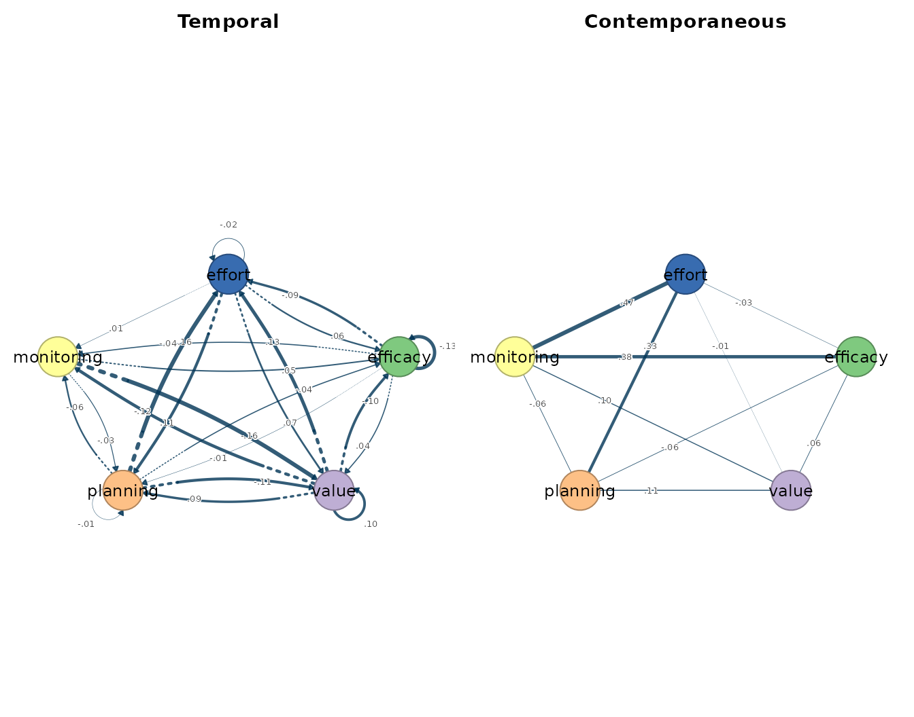
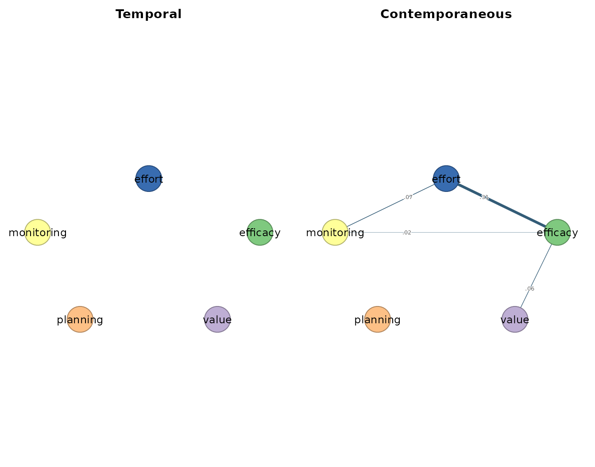

# 4. Subject-by-subject networks

``` r

library(idiographic)
data(srl)
vars <- c("efficacy", "value", "planning", "monitoring", "effort")
has_cograph <- requireNamespace("cograph", quietly = TRUE)
```

When the analysis target is the **idiographic map for every
individual**, fit one model per person with
[`build_var_each()`](https://saqr.me/idiographic/reference/build_var_each.md)
(OLS) or
[`graphical_var_each()`](https://saqr.me/idiographic/reference/graphical_var_each.md)
(regularized). Each returns a named collection of per-subject results.

## One OLS VAR per person

``` r

var_each <- build_var_each(srl, vars = vars, id = "name", scale = TRUE)

var_each
#> Idiographic OLS VARs
#>   Subjects:       36
#>   Variables:      5
#>   Lag pairs:      median 155 (range 137-155)
#>   Temporal edges: median 25 (range 25-25)
#>   Access:         x[["Aisha"]] | cograph::splot(x[["Aisha"]])
```

The collection prints a one-line-per-cohort summary (subjects,
variables, edge counts). Reach into one person’s result by name and use
the usual verbs on it:

``` r

grace <- var_each[["Grace"]]

head(edges(grace))
#>    network       from         to     weight
#> 1 temporal monitoring      value -0.1604470
#> 2 temporal   planning     effort  0.1591502
#> 3 temporal      value     effort  0.1346800
#> 4 temporal      value monitoring -0.1204242
#> 5 temporal   planning      value -0.1098008
#> 6 temporal     effort   planning  0.1080185

matrices(grace)
#> 
#> $beta
#>              [,1]   [,2]   [,3]   [,4]   [,5]   [,6]
#> efficacy   -0.004 -0.130 -0.102 -0.038  0.052  0.064
#> value       0.009  0.042  0.104 -0.110 -0.160  0.072
#> planning   -0.004 -0.009  0.090 -0.007 -0.032  0.108
#> monitoring -0.001 -0.044 -0.120 -0.057  0.004  0.007
#> effort      0.010 -0.087  0.135  0.159 -0.003 -0.024
#> 
#> $temporal
#>            efficacy  value planning monitoring effort
#> efficacy     -0.130 -0.102   -0.038      0.052  0.064
#> value         0.042  0.104   -0.110     -0.160  0.072
#> planning     -0.009  0.090   -0.007     -0.032  0.108
#> monitoring   -0.044 -0.120   -0.057      0.004  0.007
#> effort       -0.087  0.135    0.159     -0.003 -0.024
#> 
#> $residual_cov
#>            efficacy value planning monitoring effort
#> efficacy      0.976 0.110   -0.014      0.407  0.156
#> value         0.110 0.962    0.117      0.151  0.093
#> planning     -0.014 0.117    0.984      0.108  0.330
#> monitoring    0.407 0.151    0.108      0.985  0.479
#> effort        0.156 0.093    0.330      0.479  0.938
#> 
#> $kappa
#>            efficacy  value planning monitoring effort
#> efficacy      1.249 -0.071    0.069     -0.537  0.049
#> value        -0.071  1.081   -0.120     -0.130  0.013
#> planning      0.069 -0.120    1.175      0.082 -0.455
#> monitoring   -0.537 -0.130    0.082      1.613 -0.750
#> effort        0.049  0.013   -0.455     -0.750  1.600
#> 
#> $PCC
#>            efficacy  value planning monitoring effort
#> efficacy      0.000  0.061   -0.057      0.378 -0.035
#> value         0.061  0.000    0.106      0.098 -0.010
#> planning     -0.057  0.106    0.000     -0.060  0.332
#> monitoring    0.378  0.098   -0.060      0.000  0.467
#> effort       -0.035 -0.010    0.332      0.467  0.000
#> 
#> $PDC
#>            efficacy  value planning monitoring effort
#> efficacy     -0.117  0.039   -0.008     -0.040 -0.080
#> value        -0.098  0.101    0.087     -0.116  0.133
#> planning     -0.035 -0.103   -0.006     -0.053  0.150
#> monitoring    0.042 -0.128   -0.025      0.003 -0.002
#> effort        0.051  0.058    0.086      0.006 -0.020
```

[`plot()`](https://rdrr.io/r/graphics/plot.default.html) draws a chosen
subject directly — pass `subject` instead of indexing:

``` r

plot(var_each, subject = "Grace")
```



## One graphical VAR per person

[`graphical_var_each()`](https://saqr.me/idiographic/reference/graphical_var_each.md)
does the same with sparse estimation. Here we fit a handful of students
so the example runs quickly; drop the
[`subset()`](https://rdrr.io/r/base/subset.html) to fit everyone.

``` r

students <- subset(srl, name %in% c("Grace", "Eve", "Aisha", "Bob"))

gvar_each <- graphical_var_each(students, vars = vars, id = "name",
                                n_lambda = 8, gamma = 0)

gvar_each
#> Idiographic graphical VARs
#>   Subjects:               4
#>   Variables:              5
#>   Contemporaneous edges:  median 6 (range 3-9)
#>   Access:                 x[["Aisha"]] | cograph::splot(x[["Aisha"]])

summary(gvar_each[["Eve"]])
#>           network n_nodes n_edges density mean_abs_weight n_positive n_negative
#> 1        temporal       5       0     0.0       0.0000000          0          0
#> 2 contemporaneous       5       4     0.4       0.1135786          4          0
```

``` r

plot(gvar_each, subject = "Eve")
```


