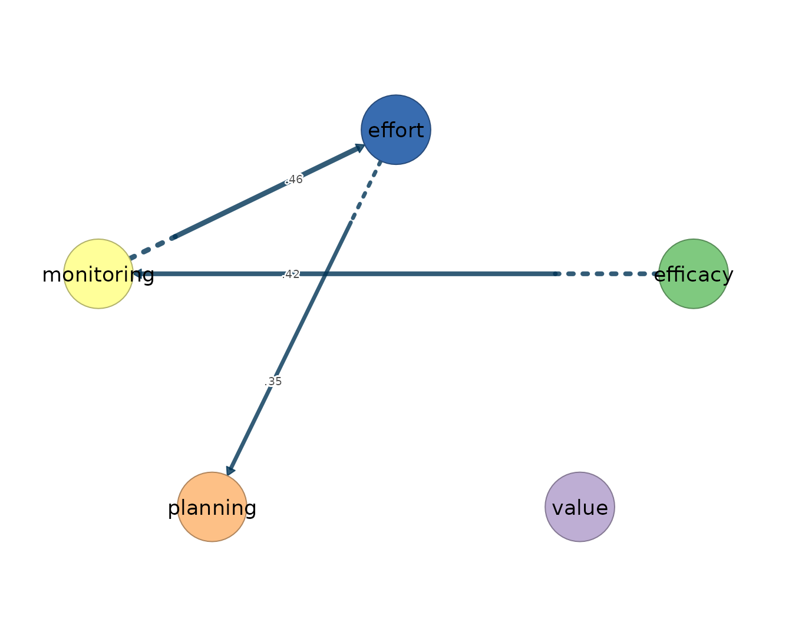
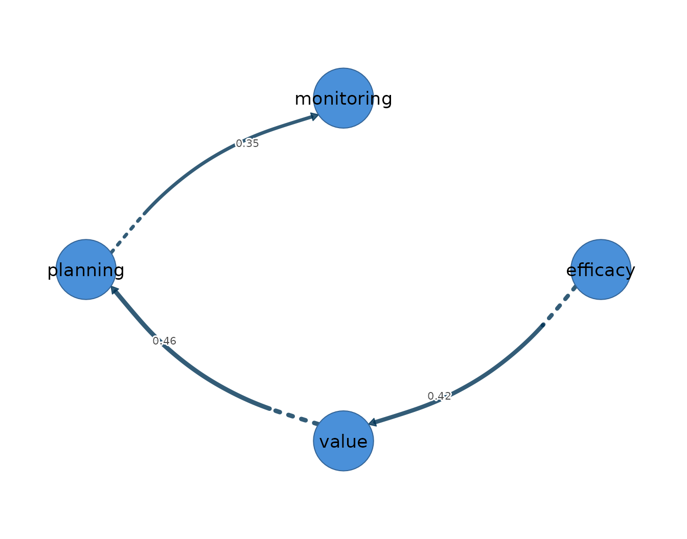

# 7. Unified SEM

Unified structural equation modelling (uSEM) specifies a person-specific
structural model for a single individual’s multivariate time series, in
which each variable at the current occasion is regressed simultaneously
on the lagged values of all variables — its own and the others’ — and on
the other variables measured at the same occasion. It is an idiographic
model, built on the premise that within-person dynamics need not match
the between-person structure of the group: every coefficient describes
how one person’s process unfolds around that person’s own means, not how
people differ from one another. Like the other lag-one estimators in
this package, it presumes weak stationarity — constant mean, variance,
and autocovariance across the observation window — linear lag-one
dynamics, and equally spaced occasions; to these it adds the
identification requirements of a structural model, since the
within-occasion paths must be estimable for each person, which
constrains how many paths can be entertained relative to the length of
the series.

The model yields three networks over the same variables. The temporal
network is directed and within-person: an edge `from -> to` states that
the person’s value of `from` at occasion $`t-1`$ predicts their value of
`to` at occasion $`t`$, holding the other lagged variables constant. The
contemporaneous network collects the within-occasion relations, and this
layer is what separates uSEM from VAR and graphical VAR: where those
models summarize same-occasion association as undirected partial
correlations among residuals, uSEM resolves each within-occasion
relation into a *directed* structural path, so an edge `from -> to`
records a directed same-occasion coefficient from `from` to `to` for
that person. What the directed paths leave unexplained is carried by the
third layer, an undirected residual-covariance network among the
innovations. The directed contemporaneous reading is warranted when
theory or design implies a within-occasion ordering among the
indicators; where no ordering is defensible, the undirected
graphical-VAR contemporaneous network is the more conservative summary.
GIMME, treated in the next vignette, extends the uSEM equation with a
group-level search that recovers paths shared across people.

[`fit_usem()`](https://mohsaqr.github.io/idiographic/reference/fit_usem.md)
estimates one SEM per selected person and returns temporal, directed
contemporaneous, and residual-covariance networks. With one selected
person, as below, every coefficient is idiographic. With multiple people
the function also averages across converged fits; that average
summarizes the sample and is not any one person’s model. Failed fits are
reported rather than silently included.

## Data and preprocessing

The estimator takes the same long-format panel as the other estimators:
one row per person-occasion, an id column, and numeric time-varying
indicators ordered within person. The bundled `srl` data hold
self-regulated-learning indicators for 36 students measured over 156
occasions each; this vignette fits Grace on five indicators: `efficacy`,
`value`, `planning`, `monitoring`, and `effort`. Grace is chosen because
her five series pass the input audit, not because of the network
returned later. Because uSEM is a dynamic lag-one model that absorbs
assumption violations silently — a trending series inflates its lagged
coefficients rather than producing an error — the stationarity screen
precedes the fit.

``` r

preprocess(srl, vars = vars, id = "name", subject = "Grace")
#> Idiographic Preprocessing
#>   Variables:      5 (efficacy, value, planning, monitoring, effort)
#>   Ordered rows:   156
#>   Retained pairs: 155
#>   Trend flags:    0
#>   High AR flags:  0
#>   Drift flags:    0
#>   Unit-root risk: 0
#>   Zero variance:  0
#>   Tables:         x$pairs | x$counts | x$diagnostics
```

Grace’s 156 rows yield 155 complete lagged pairs. None of the five
series trips the trend, high-autoregression, mean-shift, variance-shift,
unit-root, or zero-variance screen, so the series is fitted as supplied.

## Fitting the model

The substantive arguments are `time` (orders occasions within `id`),
`temporal` (`"ar"` for autoregressions only, `"all"` for candidate
cross-lags), `contemporaneous` (`"none"` or `"all"` candidate directed
same-occasion paths), and `trim`. A reciprocal all-path same-occasion
model is not identified as a final SEM. Therefore `trim = TRUE` starts
from an identified base model and uses the documented fit and
significance criteria to add and prune candidate paths; the vignette
does not present the underidentified untrimmed model as a result. The
fit and all accessors below are evaluated when the suggested `lavaan`
package is installed and the build environment permits core detection.
This second guard handles restricted builders where lavaan cannot
initialize its options; no static output is substituted when execution
is unavailable.

``` r

usem_fit <- fit_usem(srl, vars = vars, id = "name", time = "day",
                     subject = "Grace", temporal = "all",
                     contemporaneous = "all", trim = TRUE)
usem_fit
#> uSEM Result
#>   Subjects:      1 (1 converged)
#>   Variables:     5 (efficacy, value, planning, monitoring, effort)
#>   Observations:  median 155 (range 155-155)
#> 
#>   Temporal [directed]
#>     no non-zero edges
#>                efficacy value planning monitoring effort
#>     efficacy          0     0        0          0      0
#>     value             0     0        0          0      0
#>     planning          0     0        0          0      0
#>     monitoring        0     0        0          0      0
#>     effort            0     0        0          0      0
#> 
#>   Contemporaneous [directed]
#>     weights [0.348, 0.456]  |  +3 / -0 edges
#>                efficacy value planning monitoring effort
#>     efficacy          0     0     0.00       0.42   0.00
#>     value             0     0     0.00       0.00   0.00
#>     planning          0     0     0.00       0.00   0.00
#>     monitoring        0     0     0.00       0.00   0.46
#>     effort            0     0     0.35       0.00   0.00
#> 
#>   Residual_cov [undirected]
#>     no non-zero edges
#>                efficacy value planning monitoring effort
#>     efficacy          0     0        0          0      0
#>     value             0     0        0          0      0
#>     planning          0     0        0          0      0
#>     monitoring        0     0        0          0      0
#>     effort            0     0        0          0      0
#> 
#>   plot(x) | plot(x, layer = "temporal") | plot(x, layer = "contemporaneous") 
#>   edges(x) | nodes(x) | summary(x) | coefs(x) | matrices(x)
```

Grace’s model converges on 155 usable lagged pairs. The search retains
three directed contemporaneous paths and no temporal or
residual-covariance edges. That zero is an executed selection result: it
says no candidate temporal path survived this uSEM search for Grace, not
that the temporal layer was disabled.

## Reading the output

The [`summary()`](https://rdrr.io/r/base/summary.html) method reports
one row per network layer, with the edge count, density, and mean
absolute weight.

``` r

summary(usem_fit)
#>           network n_nodes n_edges density mean_abs_weight n_positive n_negative
#> 1        temporal       5       0    0.00       0.0000000          0          0
#> 2 contemporaneous       5       3    0.15       0.4091159          3          0
#> 3    residual_cov       5       0    0.00       0.0000000          0          0
```

The contemporaneous network has three of the 20 possible directed edges
(density 0.15) and mean absolute weight 0.409. The temporal and residual
layers have zero selected edges.

``` r

edges(usem_fit, network = "temporal", n = 5)
#> [1] network from    to      weight 
#> <0 rows> (or 0-length row.names)
```

The empty table makes the selection outcome explicit. It should not be
read as proof of no lagged process; a different candidate set, trimming
rule, or person can give a different selected model.

``` r

edges(usem_fit, network = "contemporaneous", n = 5)
#>           network       from         to    weight
#> 1 contemporaneous monitoring     effort 0.4560847
#> 2 contemporaneous   efficacy monitoring 0.4237396
#> 3 contemporaneous     effort   planning 0.3475233
```

The directed contemporaneous network retains monitoring to effort
(0.456), efficacy to monitoring (0.424), and effort to planning (0.348).
These arrows are directed SEM coefficients conditional on the selected
specification; causal interpretation still requires a defensible
within-occasion ordering.

``` r

nodes(usem_fit)
#>            network       node  strength out_strength in_strength self
#> 1         temporal   efficacy 0.0000000    0.0000000   0.0000000    0
#> 2         temporal      value 0.0000000    0.0000000   0.0000000    0
#> 3         temporal   planning 0.0000000    0.0000000   0.0000000    0
#> 4         temporal monitoring 0.0000000    0.0000000   0.0000000    0
#> 5         temporal     effort 0.0000000    0.0000000   0.0000000    0
#> 6  contemporaneous   efficacy 0.4237396    0.4237396   0.0000000    0
#> 7  contemporaneous      value 0.0000000    0.0000000   0.0000000    0
#> 8  contemporaneous   planning 0.3475233    0.0000000   0.3475233    0
#> 9  contemporaneous monitoring 0.8798244    0.4560847   0.4237396    0
#> 10 contemporaneous     effort 0.8036081    0.3475233   0.4560847    0
#> 11    residual_cov   efficacy 0.0000000           NA          NA    0
#> 12    residual_cov      value 0.0000000           NA          NA    0
#> 13    residual_cov   planning 0.0000000           NA          NA    0
#> 14    residual_cov monitoring 0.0000000           NA          NA    0
#> 15    residual_cov     effort 0.0000000           NA          NA    0
```

Because the contemporaneous layer is directed,
[`nodes()`](https://mohsaqr.github.io/idiographic/reference/nodes.md)
separates outgoing from incoming weight. Monitoring has the largest
total contemporaneous strength (0.880); it receives the efficacy path
and sends the effort path. The full path and residual matrices are
available from
[`coefs()`](https://mohsaqr.github.io/idiographic/reference/coefs.md)
and
[`matrices()`](https://mohsaqr.github.io/idiographic/reference/matrices.md).

``` r

matrices(usem_fit)
#> 
#> $temporal
#>            efficacy value planning monitoring effort
#> efficacy          0     0        0          0      0
#> value             0     0        0          0      0
#> planning          0     0        0          0      0
#> monitoring        0     0        0          0      0
#> effort            0     0        0          0      0
#> 
#> $contemporaneous
#>            efficacy value planning monitoring effort
#> efficacy      0.000     0        0      0.000  0.000
#> value         0.000     0        0      0.000  0.000
#> planning      0.000     0        0      0.000  0.348
#> monitoring    0.424     0        0      0.000  0.000
#> effort        0.000     0        0      0.456  0.000
#> 
#> $residual_cov
#>            efficacy value planning monitoring effort
#> efficacy          0     0        0          0      0
#> value             0     0        0          0      0
#> planning          0     0        0          0      0
#> monitoring        0     0        0          0      0
#> effort            0     0        0          0      0
```

## Visualizing the network

The temporal layer is already documented as empty, so the vignette does
not draw an empty showcase panel. The contemporaneous panel draws the
three selected directed paths, with edge width scaled to absolute weight
and colour encoding sign.

``` r

plot(usem_fit, layer = "contemporaneous")
```



The within-occasion structure can also be drawn as a mixed network.
Directed contemporaneous paths appear as curved arrows and any residual
covariances as straight edges.

``` r

plot(usem_fit, mixed = TRUE)
```



The monitoring-to-effort arrow is the largest retained coefficient. No
residual covariance survives this search. The direction of each arrow is
only as credible as the within-occasion ordering assumption behind it,
which is the consideration that should govern the choice between uSEM
and the undirected graphical-VAR contemporaneous summary.

## References
