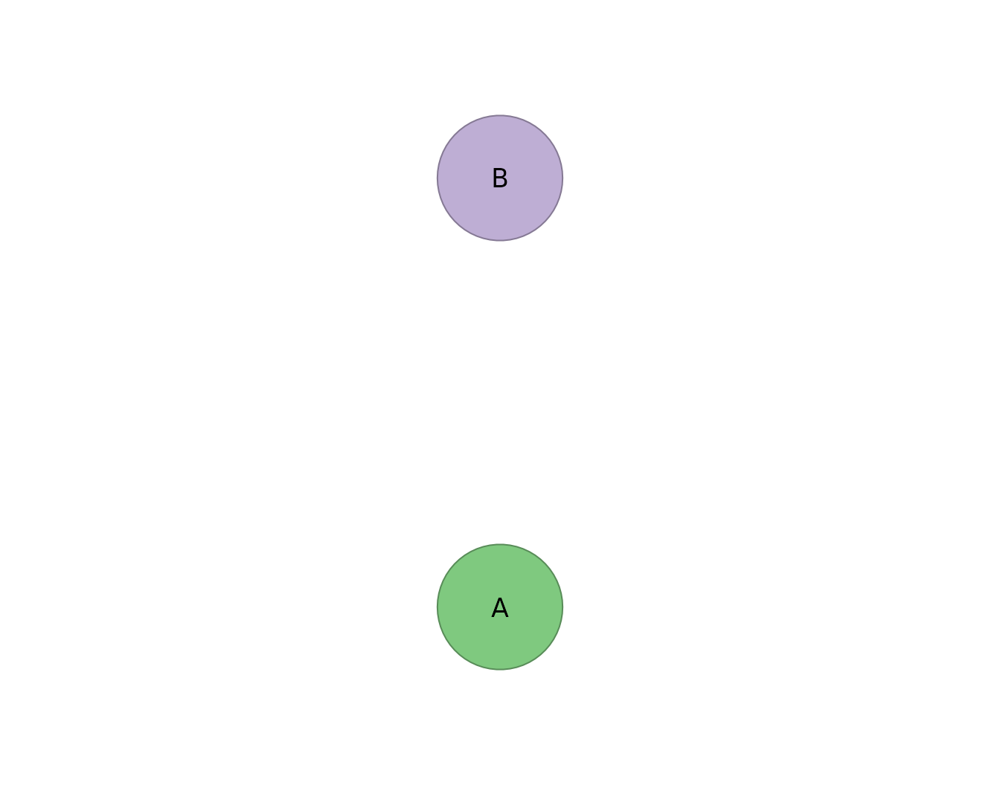

# 6. Unified SEM (uSEM)

``` r

library(idiographic)
set.seed(42)
vars <- c("A", "B")
has_cograph <- requireNamespace("cograph", quietly = TRUE)
```

[`build_usem()`](https://mohsaqr.github.io/idiographic/reference/build_usem.md)
fits a **unified SEM** over lagged and contemporaneous paths for each
person. Supply `id` plus either a `time` column or `day`/`beep` columns
so lagged rows are formed in the correct within-person order.

The vignette uses a small simulated panel so it builds quickly and
deterministi- cally on every machine. The first pass is a stable fixed
autoregressive model plus residual covariances; broader contemporaneous
search models should be checked against convergence diagnostics before
interpretation.

``` r

panel <- do.call(rbind, lapply(seq_len(4), function(i) {
  n <- 30
  ri <- stats::rnorm(length(vars), 0, 0.5)
  e <- matrix(stats::rnorm(n * length(vars)), ncol = length(vars))
  for (t in 2:n) {
    e[t, ] <- 0.35 * e[t - 1L, ] + e[t, ]
  }
  values <- as.data.frame(sweep(e, 2, ri, "+"))
  names(values) <- vars
  data.frame(
    id = i,
    day = rep(1:3, each = 10),
    beep = rep(1:10, 3),
    values
  )
}))

usem_fit <- tryCatch(
  build_usem(panel, vars = vars, id = "id", day = "day", beep = "beep",
             temporal = "ar", contemporaneous = "none", residual_cov = TRUE),
  error = function(e) {
    message("uSEM model did not converge in this R/lavaan build: ",
            conditionMessage(e))
    NULL
  }
)

if (!is.null(usem_fit)) usem_fit
#> uSEM Result
#>   Subjects:      4 (4 converged)
#>   Variables:     2 (A, B)
#>   Observations:  median 27 (range 27-27)
#> 
#>   Temporal [directed]
#>     weights [0.212, 0.279]  |  +2 / -0 edges
#>          A    B
#>     A 0.28 0.00
#>     B 0.00 0.21
#> 
#>   Contemporaneous [directed]
#>     no non-zero edges
#>       A B
#>     A 0 0
#>     B 0 0
#> 
#>   Residual_cov [undirected]
#>     weights [-0.062, -0.062]  |  +0 / -1 edges
#>           A     B
#>     A  0.00 -0.06
#>     B -0.06  0.00
#> 
#>   plot(x) | plot(x, layer = "temporal") | plot(x, layer = "contemporaneous") 
#>   edges(x) | nodes(x) | summary(x) | coefs(x) | matrices(x)
```

## Tidy tables

``` r

head(edges(usem_fit))
#>        network from to      weight
#> 1 residual_cov    A  B -0.06181167

summary(usem_fit)
#>           network n_nodes n_edges density mean_abs_weight n_positive n_negative
#> 1        temporal       2       0       0      0.00000000          0          0
#> 2 contemporaneous       2       0       0      0.00000000          0          0
#> 3    residual_cov       2       1       1      0.06181167          0          1
```

``` r

matrices(usem_fit)
#> 
#> $temporal
#>       A     B
#> A 0.279 0.000
#> B 0.000 0.212
#> 
#> $contemporaneous
#>   A B
#> A 0 0
#> B 0 0
#> 
#> $residual_cov
#>        A      B
#> A  0.000 -0.062
#> B -0.062  0.000
```

## Plot

``` r

plot(usem_fit, layer = "temporal")
```


``` r

plot(usem_fit, layer = "contemporaneous")
```


